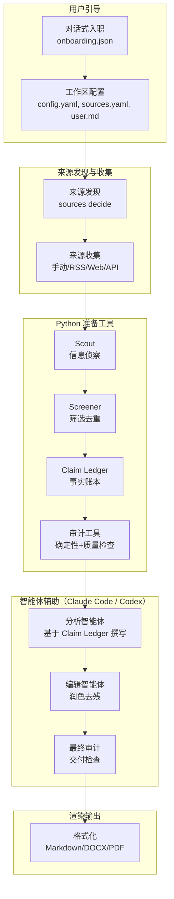

# 多Agent简报工作流工具包

<p align="center">
  <a href="README_en.md">English</a> |
  <a href="README.md">简体中文</a>
</p>

一个基于来源、可审计的智能体编排工作流工具包，用于生成商业、研究、市场、政策和管理层简报。

> 让代码负责查找，让模型负责判断，让每一个重要结论都可以追溯来源。

本项目提供工作区初始化、来源发现、来源收集、Claim Ledger/审计工具、文档渲染和 Claude/Codex 智能体工作流支持。最终简报由 Claude Code / Codex / 外部 LLM 智能体基于 Claim Ledger 和审计输出撰写。

```text
用户引导 → 工作区配置 → 来源发现 → 来源收集 → Claim Ledger/审计工具 → 智能体辅助撰写 → 最终审计 → 渲染输出
```

本项目不是投资建议工具，不是交易信号生成器，也不能替代人工审核。

## 解决什么问题

很多周报和管理层简报仍然依赖脆弱的手工流程：收集信息、判断重点、撰写分析、核验事实、编辑措辞、排版输出。这个过程很容易赶工，也很难在事后解释”这句话从哪里来”。

本仓库提供一套工具，把这个流程拆成可检查、可复用、可本地运行的模块：

- Python 工具负责来源收集、信息筛选、事实追踪和审计检查。
- Claude/Codex 智能体负责基于 Claim Ledger 撰写最终简报。
- 简报使用 `[src:CLAIM_ID]` 标注来源。
- 审计环节检查无支撑数字、过期来源、重复 claim、占位符和脱敏风险。
- 输出文件把正文、事实账本、审计报告和来源映射分开保存。

## 为什么做这个项目

在企业战略部、券商研究所、基金投研、投资者关系、总裁办、管理层办公室等场景中，很多管培生、实习生和初级分析师都会花大量时间制作日报、周报、月报、晨会材料和领导层简报。

这些工作本身很重要，因为它们连接了外部信息、内部判断和管理层决策。但现实中，很多时间并没有花在真正的分析上，而是花在高度重复的流程里：

* 从新闻、公告、财报、RSS、网页、行业资料和本地文件中收集信息；
* 判断哪些信息是本周真正值得写入报告的信号；
* 去掉重复、过时、低质量或意义不大的内容；
* 把零散事实整理成有结构的分析；
* 核对数字、日期、来源和事实依据；
* 检查 AI 是否写出了没有来源支撑的判断；
* 修改措辞、压缩篇幅、调整结构；
* 最后再输出成 Markdown、Word、PDF 或推送到协作平台。

这个项目希望把这类重复性的 briefing 工作抽象成一个开源工具包：

```text
用户引导 → 来源发现 → 来源收集 → Claim Ledger/审计 → 智能体辅助撰写 → 最终审计 → 渲染输出
```

它不是为了替代人的判断，也不是为了生成投资建议，而是希望把”来源接入、信息筛选、事实追踪”这些确定性环节交给 Python 工具，把”分析撰写、编辑润色”这些需要判断的环节交给 Claude/Codex 智能体，让每一个重要结论都可以追溯来源。

项目的核心原则是：

> 让代码负责查找，让模型负责判断，让每一个重要结论都可以追溯来源。

换句话说，这个项目不是一个简单的”AI 写周报”工具，而是一个面向真实研究和管理场景的、可审计的智能体编排工作流工具包。它希望帮助新人和分析师把时间从重复整理中释放出来，更多投入到判断、讨论、提问和决策支持上。

## 为什么不是一个 Prompt

真实的简报生产不是一个任务，而像一个小型编辑台：

- **Python 准备工具**负责来源收集、信息筛选、事实追踪和审计检查。
- **Claude/Codex 智能体**负责基于 Claim Ledger 撰写分析、润色编辑和最终审计。
- **渲染工具**负责输出 Markdown、DOCX 等格式。

把职责拆开，可以减少单个模型”顺手编”的空间。Python 工具处理确定性任务，智能体处理需要判断的任务，审计轨迹也更清楚。

## 架构



详见 [docs/architecture.zh-CN.md](docs/architecture.zh-CN.md)。

## 当前功能

本项目提供以下工具和能力：

**工作区与入职：**
- `multi-agent-brief init` 创建可复用的简报工作区
- `multi-agent-brief init --from-onboarding onboarding.json` 支持对话式入职初始化
- 入职向导映射器自动将中文岗位、行业、受众标签映射为英文配置值

**来源发现与收集：**
- `multi-agent-brief sources decide` 子命令将 `llm_decide` 来源策略解析为具体候选来源，支持 `--merge` 合并回 `sources.yaml`
- 支持手动文件、RSS、Web 搜索、API、SEC Filing、MCP、CLI 等来源提供商
- `multi-agent-brief doctor` 检查来源配置健康状态

**准备工具（Python 确定性流水线）：**
- Scout 智能体抽取候选可写入简报的事项
- Screener 智能体按新颖度评分、主题容量上限和历史去重筛选候选声明
- Claim Ledger 记录有来源支撑的事实与判断
- 确定性审计检查缺失 claim、无支撑数字、重复 claim、脱敏风险和过期来源
- Quality Harness 检查占位符、低置信来源、流程残留文本、陈旧填充内容和单位风险
- `multi-agent-brief run` 准备中间产物：`draft_brief.md`、`claim_ledger.json`、`audit_report.json`、`source_map.md`

**智能体辅助（Claude Code / Codex）：**
- Claude Code 子智能体（analyst、editor、auditor）基于 Claim Ledger 撰写最终简报
- `/generate-brief` 斜杠命令自动执行完整的智能体编排工作流
- Codex 智能体和技能配置自动生成

**渲染与输出：**
- DOCX 渲染器（默认启用）
- `python scripts/public_safe_scan.py` 公共安全扫描器检测公开文件中的个人信息和敏感内容泄露
- `python scripts/check_terms.py` 术语一致性检查器防止拼写漂移

## 输出示例

准备工具会生成带来源引用的 Markdown 草稿：

```markdown
## Market

- Synthetic module price checks showed a 3.5% week-over-week decline in selected spot-market channels. [src:MARKETDA_867A7D67D0]
```

每一条有来源支撑的表述，也会写入 `claim_ledger.json`：

```json
{
  "claim_id": "MARKETDA_867A7D67D0",
  "statement": "Synthetic module price checks showed a 3.5% week-over-week decline in selected spot-market channels.",
  "source_id": "MARKET_DATA",
  "evidence_text": "Synthetic module price checks showed a 3.5% week-over-week decline in selected spot-market channels."
}
```

审计报告会记录草稿是否已经适合分发：

```json
{
  "audit_status": "pass",
  "audit_score": 100,
  "findings": []
}
```

## 给人类的启动方式

打开你的 Claude Code 或 Codex，输入：

> Clone and read https://github.com/Stahl-G/multi-agent-brief-workflow

接着按照提示运行就可以了。Agent 会自动完成安装、引导配置、生成简报的全流程。

如需联网搜索，请在 [tavily.com](https://tavily.com) 注册并获取 Tavily API key，设置环境变量：

```bash
export TAVILY_API_KEY=<your-key>
```

---

## 快速开始（开发者 / 手动操作）

macOS / Linux / WSL:

```bash
git clone https://github.com/Stahl-G/multi-agent-brief-workflow.git
cd multi-agent-brief-workflow
bash scripts/setup.sh
source .venv/bin/activate

# 1. 初始化工作区（推荐使用对话式引导，详见 docs/onboarding.md）
multi-agent-brief init ../mabw-workspace --language zh-CN --company "公司名" --industry manufacturing --title "周报" --audience management

# 2. 添加源文件
echo "- 行业信息摘要" > ../mabw-workspace/input/news.md

# 3. 检查配置
multi-agent-brief doctor --config ../mabw-workspace/config.yaml

# 4. 运行流水线
multi-agent-brief run --config ../mabw-workspace/config.yaml

# 查看输出
cat ../mabw-workspace/output/brief.md
```

> **注意：** `multi-agent-brief run` 生成的是确定性草稿，不是最终简报。如需交付给用户的正式简报，需要在 CLI 运行后调用 Claude Code 子智能体（analyst → editor → auditor → formatter）。使用 `/generate-brief <workspace>` 可以自动执行完整流程。

Windows 10/11 推荐使用原生 PowerShell 5.1 或 PowerShell 7，不要求 WSL/Git Bash。CMD 不是主要支持目标。

```powershell
git clone https://github.com/Stahl-G/multi-agent-brief-workflow.git
cd multi-agent-brief-workflow
.\scripts\setup.ps1
.\.venv\Scripts\Activate.ps1

multi-agent-brief init ../mabw-workspace --language zh-CN --company "公司名" --industry manufacturing --title "周报" --audience management
echo "- 行业信息摘要" > ../mabw-workspace\input\news.md
multi-agent-brief doctor --config ../mabw-workspace\config.yaml
multi-agent-brief run --config ../mabw-workspace\config.yaml
```

也可以使用内置示例快速验证：

```bash
multi-agent-brief run examples/basic_market_brief/input --output output/basic_market_brief
```

示例配置启用了严格的周报时间窗口：

```yaml
report:
  date: "2026-06-02"
  max_source_age_days: 14
  fail_on_stale_source: true
```

启用该模式后，三个月前的来源不能作为本周事项通过审计。

查看生成文件：

```text
output/basic_market_brief/brief.md
output/basic_market_brief/claim_ledger.json
output/basic_market_brief/audit_report.json
output/basic_market_brief/source_map.md
```

## 更多示例

运行合成的 earnings-season peer demo：

```bash
multi-agent-brief run --config examples/earnings_season_peer_demo/config.yaml
```

PowerShell:

```powershell
multi-agent-brief run --config examples/earnings_season_peer_demo/config.yaml
```

这个 demo 只使用虚构同行名称和合成来源数据，用来展示 earnings、competitor、policy 和 market 信号如何进入 Claim Ledger 与审计报告。

## 不安装也可以运行

macOS / Linux / WSL:

```bash
PYTHONPATH=src python -m multi_agent_brief.cli.main run examples/basic_market_brief/input --output output/basic_market_brief
```

PowerShell:

```powershell
$env:PYTHONPATH = "src"
python -m multi_agent_brief.cli.main run examples/basic_market_brief/input --output output/basic_market_brief
Remove-Item Env:PYTHONPATH
```

## 启用 Tavily 实时搜索

Web 搜索默认关闭。启用需要 Tavily API key。

初始化时可选择启用 Tavily（交互式向导会询问），或手动编辑 `sources.yaml`：

```yaml
web_search:
  enabled: true
  backend: tavily
  api_key_env: TAVILY_API_KEY
  topic: news
  search_depth: basic
  max_results: 5
  search_tasks:
    - query: "manufacturing tariff trade policy"
      domains:
        - "reuters.com"
        - "bloomberg.com"
```

2. 设置环境变量并运行：

```bash
export TAVILY_API_KEY=tvly-your-key-here
multi-agent-brief run --config ../mabw-workspace/config.yaml
```

PowerShell:

```powershell
$env:TAVILY_API_KEY = Read-Host "Enter your Tavily API key"
multi-agent-brief run --config ../mabw-workspace/config.yaml
```

3. 检查配置健康：

```bash
multi-agent-brief doctor --config ../mabw-workspace/config.yaml
```

注意事项：
- Web 搜索默认禁用，必须显式启用
- Tavily 需要 `TAVILY_API_KEY` 环境变量
- API key 必须存储在环境变量中，不能写入配置文件
- 配置文件中不会打印或存储 API key
- 如果启用了 Tavily 但未设置 API key，流水线会立即报错退出（fail-fast）
- Web 搜索结果可能不包含可靠的 `published_at` 日期，时间敏感的 web_search 来源应人工核实
- Web 搜索结果包含 boilerplate 过滤（cookie/隐私政策/目录等），但不完美
- 实时搜索功能在通过线上 smoke 测试前不算发布就绪（not release-ready）

## llm_decide 来源发现

默认的 `llm_decide` 来源模式让 agent 根据 `user.md` 自动生成搜索意图和候选来源，无需手动配置：

```bash
# 1. 使用 llm_decide 初始化
multi-agent-brief init ../mabw-workspace --language zh-CN --company "公司名" --industry manufacturing --source-profile llm_decide

# 2. 生成候选来源（模板模式，无需 API key）
multi-agent-brief sources decide --config ../mabw-workspace/config.yaml

# 3. 审查候选来源
cat ../mabw-workspace/source_candidates.yaml

# 4. 合并到正式来源
multi-agent-brief sources decide --config ../mabw-workspace/config.yaml --merge

# 5. 运行流水线
multi-agent-brief run --config ../mabw-workspace/config.yaml
```

llm_decide 模式不阻塞流水线运行——即使尚未执行 `sources decide`，流水线也会使用本地 `input/` 目录中的文件继续运行，并显示警告。

## DOCX 输出

初始化工作区时，默认输出格式已包含 `docx`。运行流水线会同时生成 `brief.md` 和 `brief.docx`。

DOCX 需要 `python-docx` 依赖。使用 `.[dev]` 安装时已包含：

```bash
pip install -e ".[dev]"
```

单独安装：

```bash
pip install "multi-agent-brief-workflow[docx]"
```

DOCX 使用专业投行风格排版，支持标题层级、表格、列表、引用块、代码块等 Markdown 元素。默认页脚为 "Confidential — Internal Use Only"，可在 `config.yaml` 的 `output.footer` 中自定义。

如果未安装 `python-docx`，流水线不会中断，但会在 `audit_report.json` 中记录 `docx_generation: skipped_missing_dependency`。

## CLI

创建一个合成 demo 工作区：

```bash
multi-agent-brief init ../mabw-workspace --demo
multi-agent-brief run --config ../mabw-workspace/config.yaml
```

PowerShell:

```powershell
multi-agent-brief init ../mabw-workspace --demo
multi-agent-brief run --config ../mabw-workspace/config.yaml
```

审计已有简报：

```bash
multi-agent-brief audit output/basic_market_brief/brief.md \
  --ledger output/basic_market_brief/claim_ledger.json \
  --output output/basic_market_brief/audit_report.json
```

PowerShell:

```powershell
multi-agent-brief audit output/basic_market_brief/brief.md `
  --ledger output/basic_market_brief/claim_ledger.json `
  --output output/basic_market_brief/audit_report.json
```

打印版本号：

```bash
multi-agent-brief version
```

## Auditor Agent Interface

流水线层面的 `AuditorAgent` 会委托给实现了 `AuditAgentInterface` 的审计后端。

当前审计后端包括：

- `DeterministicAuditAgent`：检查 source ID、无支撑数字、重复 claim、缺失来源证据、脱敏风险和报告时间窗口内的来源新鲜度。
- `QualityHarnessAuditAgent`：迁移自本地 workflow prototype 的公开安全质量门控，包括占位符、内部流程残留文本、`needs_recrawl`、低来源密度和潜在单位膨胀风险。
- `NoOpSemanticAuditAgent`：为未来基于模型的语义来源支撑审查预留的占位适配器。
- `CompositeAuditAgent`：先运行确定性审计，再运行可选的语义审计适配器。

这样可以让 MVP 在没有 API key 的情况下运行，同时为 Claude、OpenAI、LiteLLM 或本地模型审计智能体保留干净接口。

详见 [docs/harness.md](docs/harness.md)。

严格终稿交付门详见 [docs/harness_matrix.md](docs/harness_matrix.md)。Codex、Claude Code subagents 和外部 agent 的协作/交接方式详见 [docs/agent-collaboration.md](docs/agent-collaboration.md)。

## 智能体支持

本仓库可以从一个角色清单自动生成 Codex 和 Claude Code 的智能体配置。

- `configs/agent_roles.yaml` 是唯一事实来源。
- `scripts/generate_agent_configs.py` 生成平台特定文件。
- `AGENTS.md` 为 Codex 及其他编码智能体提供项目级指令。
- `.agents/skills/*/SKILL.md` 提供 Codex 兼容的技能文件。
- `.codex/agents/*.toml` 提供 Codex 自定义智能体。
- `.claude/agents/*.md` 提供 Claude Code 子智能体。
- `docs/agents/` 记录平台适配和 harness 子智能体设计。

重新生成配置：

```bash
python scripts/generate_agent_configs.py --write
```

PowerShell:

```powershell
python scripts/generate_agent_configs.py --write
```

检查生成文件：

```bash
python scripts/generate_agent_configs.py --check
```

PowerShell:

```powershell
python scripts/generate_agent_configs.py --check
```

Windows 原生 PowerShell 详细说明见 [docs/windows-powershell.md](docs/windows-powershell.md)。WSL 是可选高级路径，不是必需条件。

## Claude Code 智能体模式

本仓库支持 Claude Code 子智能体编排层，提供交互式的来源规划、信息提取、分析撰写和编辑校对能力。

**重要说明：** Python CLI 不会自动调用 Claude Code 子智能体。在 Claude Code 中，使用 `/generate-brief <workspace>` 或要求 Claude Code 运行子智能体辅助工作流。子智能体是提示层编排，不是 Python SDK 调用。

### 两层架构

| 层 | 用途 | 特点 |
|----|------|------|
| Python CLI | 确定性流水线执行、审计、输出 | 可测试、无需 API key |
| Claude Code 子智能体 | 交互式来源规划、信息提取、分析、编辑 | 模型辅助判断 |

两层互补，不互相替代。Python CLI 是流水线逻辑和审计门控的事实来源。

### 可用子智能体

子智能体定义在 `.claude/agents/` 目录下：

| 子智能体 | 用途 |
|----------|------|
| `source-planner` | 生成/优化来源候选和搜索任务 |
| `scout` | 从源文件中提取候选事项 |
| `analyst` | 撰写管理层就绪的简报章节 |
| `editor` | 改善可读性，不添加新事实 |
| `auditor` | 审核最终简报，检查来源支撑 |

### 使用示例

```text
# 来源规划
"Use the source-planner subagent to create sources for the workspace at ../mabw-workspace."

# 信息提取
"Use the scout subagent to extract claims from the latest search results."

# 运行流水线
multi-agent-brief run --config ../mabw-workspace/config.yaml

# 分析改进
"Use the analyst subagent to improve the brief while preserving citations."

# 审核验证
"Use the auditor subagent to verify the final output."
```

详见 [docs/claude-code-workflow.md](docs/claude-code-workflow.md) 和 [docs/claude-code-quickstart.md](docs/claude-code-quickstart.md)。

## 路线图

- MVP：本地输入、Claim Ledger、确定性审计、Markdown 输出、来源映射和质量门控。
- 近期：PDF 输出、SEC/RSS 连接器、语义审计适配器、更完整的合成示例和文档。
- 中期：行业模块、角色化简报模板、外部分析插件、本地语料检索和来源分级策略。
- 长期：可选的内部消息接入、数据库与语义层集成、多模型路由和企业部署模式。

详见 [docs/roadmap.zh-CN.md](docs/roadmap.zh-CN.md)。

## 安全与非投资建议声明

不要提交凭证、token、webhook、原始内部日志、私有报告、客户名称、机密文件、内部路径或公司特定 prompt。本仓库中的所有示例都应使用公开数据或合成数据。

本项目可以帮助组织研究和简报流程，但不提供法律、金融、投资、交易或合规建议。任何真实分发或决策使用前，都需要人工审核。

## 更新日志

### v0.6.0 — 用户画像驱动的来源发现

- **user.md 成为主要语义控制层**：初始化时生成 `user.md`，包含公司、行业、岗位、关注领域、任务目标、禁止来源等完整用户画像，agent 优先读取此文件理解用户需求。
- **简化 onboarding mapper**：移除长关键词映射表，未知行业返回空字符串而非猜测的 slug，原始用户文本完整保留在 `user.md` 中。
- **默认 llm_decide 来源模式**：默认使用 agent 驱动的来源发现策略，生成 `source_candidates.yaml` 供用户确认后进入正式 `sources.yaml`。
- **行业包变为可选种子**：行业包不再作为路由机制，仅作为可选的搜索任务种子加速器。
- **新增 `--tavily` CLI 标志**：`multi-agent-brief init --tavily` 直接启用 Tavily 实时搜索后端。
- **修复 `format_scalar(None)` 输出 `"None"` 而非 `null`**。
- 保持 `--industry`、`--company`、`--source-profile` 等 CLI 参数的向后兼容性。

### v0.5.1 — Source Provider 流水线修复

- 修复 ScoutAgent 无条件覆盖 context.sources 的问题：当 pipeline 已通过 provider 收集来源时，Scout 直接使用已有 sources，不再回退到本地文件。
- 修复 AnalystAgent 只渲染 5 个 topic 的问题：扩展到 Screener 的完整 10 个 topic（新增 compliance、demand、rates、capital、technology），未知 topic 也会追加渲染。
- 修复 merge_candidates_to_sources() 自动启用 web_search 的问题：merge 不再隐式开启 web_search，防止 mock 搜索结果污染真实报告。
- 修复 WebSearchProvider 使用 hash() 生成不稳定 source_id 的问题：改用 hashlib.sha1 确保跨进程一致。
- 修复 Manual URL placeholder 进入 Claim Ledger 的问题：placeholder source 增加 requires_fetch metadata，Scout 自动跳过。
- 修复 collect_all_sources() 静默吞掉 provider 异常的问题：错误记录到返回值的 errors 列表，pipeline artifacts 包含 collection_errors。
- 新增 10 个测试覆盖所有修复。
- 修复 web_search.py 嵌套 f-string 在 Python 3.9 下的 SyntaxError，改用中间变量。
- CI 新增 compileall 步骤，提前捕获语法兼容性问题。
- 修复 init --industry 未写入 source_strategy.industry 的问题，确保 SourcePlanner 能收到用户选择的行业。
- 修复 WebSearchProvider.collect() 内部静默吞掉 backend 异常的问题，异常现在传递到 registry errors。
- 实现 WebSearchProvider 域名过滤：config.search_tasks 支持 domains 字段并传递到 backend.search()。
- 更新 doctor.py：web_search 使用 mock backend 时给出准确警告文案，不再提示 Phase 1 未实现。
- 移除运行时 MockSearchBackend：src/ 中不再有 mock 搜索后端，web_search.enabled=true 且无真实 backend 时明确失败。
- 所有 init profile 默认不启用 web_search，需用户自行配置真实 backend。

### v0.5.0 — 三层来源采集架构

- 新增 `SourcePlanner`：根据行业、岗位、时间窗口自动生成搜索计划。
- 新增 `industry_packs.py`：行业预设包（manufacturing、banking、fund、internet、general），含搜索任务。
- `WebSearchProvider` 支持可插拔搜索后端接口（tavily、serpapi 等），不附带运行时 mock backend。
- 新增 `CachedPackageProvider`：读取预收集的源包文件夹（支持 OpenClaw 式工作流）。
- 新增 `search_backends/` 模块：SearchBackend ABC（可插拔后端接口）。
- 统一 SourceItem：消除 `core/schemas.py` 和 `sources/base.py` 的重复定义。
- Pipeline 重构：Source Collection → Scout → Screener → ...，Scout 从 Provider 系统读取。
- CLI 新增 `--industry` 和 `--days` 参数，支持行业感知的自动采集。
- 向后兼容：无 source_config 时仍可从 input_dir 读取本地文件。
- 14 个新测试覆盖 SourcePlanner、行业包、WebSearch、CachedPackage、Pipeline 集成。

### v0.4.0 — 信息来源提供器系统

- 新增 `sources/` 模块：统一的 SourceProvider 接口，支持所有信息来源。
- 三种来源策略：conservative、research、aggressive_signal。
- Manual provider：加载本地 .md/.txt/.json 文件和手动 URL 条目。
- RSS provider：获取并解析 RSS/Atom 订阅源，支持关键词过滤。
- Stub providers：web_search、api、mcp、cli（Phase 1 占位）。
- 来源归一化、去重和时效性过滤。
- `multi-agent-brief doctor`：检查来源配置健康状态。
- Init 向导新增来源策略选择，生成定制化 `sources.yaml`。
- 新增 21 个测试，覆盖 provider、normalizer、registry 和 doctor。

### v0.3.0 — 智能体配置生成

- 新增 `configs/agent_roles.yaml` 作为所有智能体角色的唯一事实来源。
- 新增 `scripts/generate_agent_configs.py` 生成平台特定智能体配置。
- 生成 Codex 智能体（`.codex/agents/*.toml`）、技能文件（`.agents/skills/*/SKILL.md`）。
- 生成 Claude Code 子智能体（`.claude/agents/*.md`）。
- 生成文档（`docs/agents/`）。
- 新增 25 个测试，覆盖 manifest 验证、生成逻辑和内容检查。
- `--check` 模式用于 CI 中检测生成文件是否过期。

### v0.2.0 — Screener 筛选师

- 在 Scout 与 Analyst 之间新增 ScreenerAgent。
- 10 个主题分类，每个主题有容量上限（总计最多 160 条声明）。
- 新颖度评分：叠加源层级、声明类型和高信号词权重。
- 历史报告去重：通过文本匹配和主题词组检测排除重复内容。
- 过期源和低置信源（T5）自动排除。
- 历史报告加载器，支持 `.md`、`.txt` 和 `.docx` 格式。
- 新增 pre-push hook 和 CI 检查：推送代码前必须更新 README。

## 开发

```bash
python -m pytest -q
```

PowerShell:

```powershell
python -m pytest -q
```

## 欢迎参与

目前这个项目主要由我一个人维护，仍处于早期阶段。

我非常欢迎有过类似工作、实习或研究经历的同学一起参与、试用或提 issue。这个项目要真正变得有用，不能只靠一个人的工作场景来定义，而需要来自不同行业、不同岗位、不同职业阶段的人一起补充真实需求。

尤其欢迎以下背景的朋友参与：

* 企业战略部、总裁办、管理层办公室；
* 券商研究所、基金投研、PE/VC、产业投资；
* 投资者关系、董秘办、公司治理、法务合规；
* 行业研究、市场研究、政策研究；
* 咨询、产业研究、竞争情报、商业分析；
* 曾经负责过日报、周报、月报、晨会材料、领导简报的实习生、管培生或初级分析师；
* 正在尝试把 AI agent 用到真实 office work、research workflow 或 internal briefing 的开发者。

你可以参与的方式包括：

* 提出一个真实使用场景；
* 反馈你所在岗位最痛苦、最重复的 briefing 环节；
* 提供某个行业的周报结构建议；
* 设计一个新的行业模块、岗位模块或外部分析模块；
* 试用 demo 并指出哪里不像真实工作流；
* 提交 issue、discussion 或 pull request；
* 帮助完善中英文文档、示例、测试和安全边界。

我尤其希望收集这些问题的反馈：

* 你的岗位通常需要写什么类型的简报？
* 周报、月报或日报里最浪费时间的是哪一步？
* 哪些内容必须人工判断，哪些可以被自动化？
* 哪些事实最容易被 AI 写错？
* 管理层、基金经理、研究主管、IR、法务或合规分别关心什么？
* 不同行业的周报模板应该有什么差异？
* Source Provider、Screener、Claim Ledger、Auditor 这些模块在你的真实工作中应该怎样设计才有用？

即使只是提出一个痛点、一个模板建议、一个真实反例，或者一个"不应该这样自动化"的提醒，也会对项目很有帮助。

## 许可证

MIT
