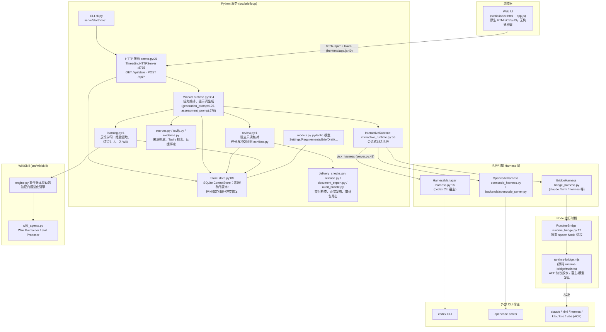

# BriefLoop 架构

> 本图由代码调研绘制（2026-09-12），依据均指向仓库源码。BriefLoop 是本地研究与报告工具：主 Agent 负责对话、研究规划、写稿与修订，Evaluator / Wiki Maintainer / Skill Proposer 独立运行，所有结论绑定证据版本。

## 整体架构图

## 分层说明

1. **界面层**：界面源码在 `frontend/`（app.js、rich-document.js），由 esbuild 打包（`npm run build`，`package.json`）输出到 `src/briefloop/static/app.js`，Python 服务只发布 `static/`（原生无框架运行时 + 打包后的 bundle，含 tiptap 富文档依赖）。浏览器用带 `X-BriefLoop-Token` 的 JSON 请求访问 `/api/*`，token 过期时自动重新握手（`frontend/app.js:40` 的 `api()`）。

2. **服务层**：`cli.py` 的 `serve/start` 进入 `server.py:make_server()`。服务以工作区为单位单实例运行（`fcntl` 锁，`server.py:28`），启动时组装 Store、各 Harness 管理器和 `Worker`，并一次性恢复中断的会话状态（`harness.chat.recover_stale()`）。`GET /api/state` 返回整个工作区快照，写操作走 `POST /api/<命令>`。

3. **执行层**：`Worker`（`runtime.py:334`）负责把任务分阶段（`stage_job`）、按角色生成提示词并调度；`InteractiveRuntime` 把每个会话请求路由到 `pick_harness()` 选择的引擎，且同一会话锁定原宿主（切换引擎须新建会话，`server.py:45`）。引擎有三种宿主方式：codex CLI（`HarnessManager`）、opencode server（`OpencodeHarness`）、以及通过 Node 桥的 ACP 宿主（claude/kimi/hermes 等，`BridgeHarness` → `RuntimeBridge` spawn `static/runtime-bridge.mjs`，源码在 `runtime-bridge/main.ts`，复用 `third_party/open-design` 的 Apache 协议辅助代码）。

4. **数据层**：`Store`（`store.py:88`）是精简 SQLite ControlStore，保存来源（含 Tavily 抓取与 PDF/图片 sidecar，`sources.py`/`tavily.py`/`media.py`）、稿件版本、证据绑定（`evidence.py`）、评分与事件流；pydantic 模型集中在 `models.py`。低分稿件不隐藏，工作稿始终可下载。

5. **核验与交付层**：`review.py` 做独立只读核对（评审模型收到打包的稿件、证据与本任务历史，不重跑分析），冲突由 `conflicts.py` 记录；`delivery_checks.py`/`release.py` 把正式交付与证据版本绑定，`audit_bundle.py` 按用户选择导出审计包（不含凭据与隐藏推理）。

6. **学习层**：`learning.py` 把报告反馈排入队列，提取经验、生成试错对比（`_generate_trial`），再把获胜修订交给 `src/wikiskill/engine.py`——一个以追加式事件账本为准、带验证门控的技能进化引擎，由 Wiki Maintainer / Skill Proposer（`officeqa/wiki_agents.py`）维护既有 WikiSkill。

## 边界事实

- Python 只负责工具、进程、存储、确定计算与既定选择规则；规划/研究/写作/评分都由 CLI 宿主里的实际 agent 完成（AGENTS.md 约定）。
- 一个工作区同时只允许一个服务实例（`server.py:28` 的 `fcntl` 锁）。
- runtime-bridge 需要本机 Node 20+，构建产物为 `src/briefloop/static/runtime-bridge.mjs`（`runtime-bridge/build.mjs`）。
- 后端可选：`codex/opencode/claude/kimi/hermes/reasonix/mimo`（`cli.py:21`），ACP 类宿主经 Node 桥。
