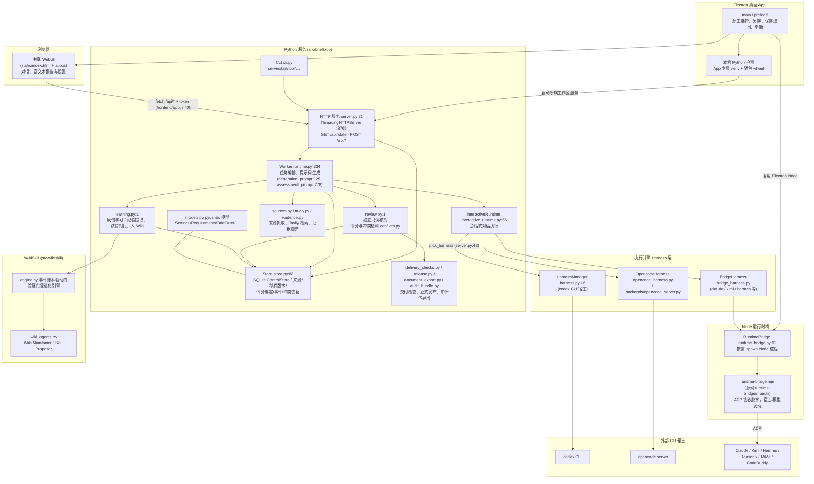

# BriefLoop 架构

> 0.20.0 架构说明，更新于 2026-09-13。BriefLoop 是本地研究与报告工具：主 Agent 负责对话、研究规划、写稿与修订，Evaluator / Wiki Maintainer / Skill Proposer 独立运行。稿件、证据与审阅分别保存并绑定版本；绑定本身不证明结论正确。

## 整体架构图

## 分层说明

1. **界面层**：界面源码在 `frontend/`（app.js、rich-document.js），由 esbuild 打包（`npm run build`，`package.json`）输出到 `src/briefloop/static/app.js`，Python 服务只发布 `static/`（原生无框架运行时 + 打包后的 bundle，含 tiptap 富文档依赖）。浏览器的 JSON POST 带 `X-BriefLoop-Token`，token 过期时自动重新握手（`frontend/app.js:40` 的 `api()`）。

2. **服务层**：`cli.py` 的 `serve/start` 进入 `server.py:make_server()`。服务先取得 `platform_support.WorkspaceLock`，再初始化 Store；POSIX 使用 `flock`，Windows 使用排他字节锁。启动时组装各 Harness 管理器和 `Worker`，并一次性恢复中断的会话状态（`harness.chat.recover_stale()`）。`GET /api/state` 返回整个工作区快照，写操作走 `POST /api/<命令>`。

3. **执行层**：`Worker`（`runtime.py:334`）负责把任务分阶段（`stage_job`）、按角色生成提示词并调度；`InteractiveRuntime` 把每个会话请求路由到 `pick_harness()` 选择的引擎，且同一会话锁定原宿主（切换引擎须新建会话，`server.py:45`）。引擎有三种宿主方式：codex CLI（`HarnessManager`）、opencode server（`OpencodeHarness`）、以及通过 Node 桥的 ACP 宿主（claude/kimi/hermes 等，`BridgeHarness` → `RuntimeBridge` spawn `static/runtime-bridge.mjs`，源码在 `runtime-bridge/main.ts`，复用 `third_party/open-design` 的 Apache 协议辅助代码）。

4. **数据层**：`Store`（`store.py:88`）是精简 SQLite ControlStore，保存来源（含 Tavily 抓取与 PDF/图片 sidecar，`sources.py`/`tavily.py`/`media.py`）、稿件版本、证据绑定（`evidence.py`）、评分与事件流；pydantic 模型集中在 `models.py`。低分稿件不隐藏，工作稿始终可下载。

5. **核验与交付层**：`review.py` 做独立只读核对（评审模型收到打包的稿件、证据与本任务历史，不重跑分析），冲突由 `conflicts.py` 记录；`delivery_checks.py`/`release.py` 把正式交付与证据版本绑定，`audit_bundle.py` 按用户选择导出审计包（不含凭据与隐藏推理）。

6. **学习层**：`learning.py` 把报告反馈排入队列，提取经验、生成试错对比（`_generate_trial`），再把获胜修订交给 `src/wikiskill/engine.py`——一个以追加式事件账本为准、带验证门控的技能进化引擎，由 Wiki Maintainer / Skill Proposer（`officeqa/wiki_agents.py`）维护既有 WikiSkill。

## 边界事实

- Python 只负责工具、进程、存储、确定计算与既定选择规则；规划/研究/写作/评分都由 CLI 宿主里的实际 agent 完成（AGENTS.md 约定）。
- 一个工作区同时只允许一个服务实例（`platform_support.WorkspaceLock` 的操作系统锁）。Windows 所属宿主进程树由 Job Object 回收；它不提供文件或网络隔离。
- runtime-bridge 需要本机 Node 20+，构建产物为 `src/briefloop/static/runtime-bridge.mjs`（`runtime-bridge/build.mjs`）。
- 内置引擎 `briefloop-native`（`native-engine/`，内嵌 pi SDK，构建产物 `src/briefloop/static/native-engine.mjs`）需要 Node 22.19+。第一阶段只执行受限独立审阅。系统提示词由 BriefLoop 分层装配：共用底线、当前角色、执行模式三段来自 `src/briefloop/prompt_assets/`（`agent_prompts.py`），引擎再按实际注册的工具追加工具说明；任务消息只放本次冻结的审阅要求（`review.py` 按后端给出如实的操作说明）。工具全部限定在核查包内：`packet_list`、`packet_read`（按行或 JSON 路径分段读取）、`packet_grep`、`claim_trace`、`calc`（纯算术）和 `submit_review`；提交时先按 `output.schema.json` 校验，再通过线协议交回 Python 执行与正式接纳相同的检查（`review.check_review`），未通过的错误退回模型修正。模型接收图像时，报告图随首条消息发送。不读取 `~/.pi` 的设置，只能绑定到审阅任务，不能作为主链执行后端。模型凭据来自 provider 环境变量（如 `DEEPSEEK_API_KEY`）或 pi 的 `auth.json`，BriefLoop 尚无凭据界面。
- 后端可选：`codex/opencode/briefloop-native/claude/kimi/hermes/reasonix/mimo/codebuddy/kilo/kiro/vibe/deepseek-harness/antigravity/pi`（以 `src/briefloop/backends/__init__.py` 的 `BACKENDS` 为准）。登记可选不代表每个宿主的所有能力均已实测；桥接宿主的具体通道与权限以对应适配器为准。
- 默认桌面构建：Mac 代码签名=关闭；DMG 签名=关闭；Windows 强制代码签名=关闭。单独的签名构建脚本需要配置证书及公证凭据，脚本存在不代表发行包已经签名或公证；实际工件以发行记录为准。

私有 GET 统一检查 Origin 与 Fetch Metadata，拒绝明确的跨源浏览器请求（包括同机不同端口）。同源链接、地址栏导航及无浏览器来源头的本机客户端仍可下载，不在 URL 中携带会话 Token。服务仅监听 127.0.0.1 并严格校验 Host；这些机制不隔离同机进程，握手 Token 也不构成 OS 用户级认证。
