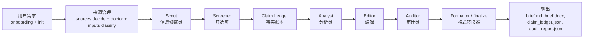

# 架构说明

这个项目是一个 subagent-first 简报工作流：Python CLI 负责工作区管理、来源治理、质量门控和最终渲染；AI agent runtime 通过 handoff artifact 协调角色子智能体执行简报生成。

## 核心流程

灰底步骤（来源治理、finalize）由 Python CLI 执行；白底步骤（Scout → Auditor）由 runtime 子智能体按 handoff artifact 执行。

## 运行时

### Hermes（主路径）

Hermes 使用 `delegate_task` 原生子代理管线：scout → screener → claim-ledger → analyst → editor → auditor。Python CLI 提供 init、doctor、inputs classify、finalize 工具；cron 处理定时调度。

### Claude Code / OpenCode / Codex

通过 `multi-agent-brief run --workspace <path> --runtime claude|opencode|codex` 生成 `agent_handoff.md`，由对应平台的斜杠命令和子智能体配置执行。

## 输入治理

`input/` 下有四个约定子目录：

| 目录 | 角色 | 是否进入 Claim Ledger |
|---|---|---|
| `input/sources/` | 证据文件 | ✅ |
| `input/feedback/` | 编辑反馈 | ❌ |
| `input/instructions/` | 任务要求 | ❌ |
| `input/context/` | 背景参考 | ❌ |

`multi-agent-brief inputs classify --config <path>` 自动分类并产出 `input_classification.json`。Scout 被约束只从 `input/sources/` 和 `input/` 根目录（向后兼容）提取声明。ManualProvider 代码层阻止非证据目录作为 source。

## 各角色职责

### Scout 信息侦察员

读取证据文件、来源包、搜索输出，抽取候选可报告事项，写入 `candidate_claims.json`。不负责分析写作。

### Screener 筛选师

按新颖度、来源层级、主题容量、历史重复筛选候选声明，写入 `screened_candidates.json`。

### Claim Ledger 事实账本

将筛选后候选转为稳定、可追溯的 claim，写入 `claim_ledger.json`。每个 claim 有唯一 ID、证据文本、来源引用。这是整个流程的控制点：重要表述必须能追溯到 claim。

### Analyst 分析员

只使用 Claim Ledger 中的 claim 写草稿，生成带 `[src:CLAIM_ID]` 引用的 `audited_brief.md`。不写投资建议，不编造事实。

### Editor 编辑

改善结构、可读性和管理层表达。不发明新事实、不添加无支撑数字。清除 `[SRC:]` 等过程残留，保留有效 `[src:CLAIM_ID]`。

### Auditor 审计员

检查引用支撑、来源新鲜度、数字准确性、投资建议措辞、敏感信息泄漏、过程残留。委托给 `CompositeAuditAgent`（`DeterministicAuditAgent` + `QualityHarnessAuditAgent` + 可选 `SemanticAuditAgent`），写入 `audit_report.json`。

### Formatter / finalize

`multi-agent-brief finalize` 从 `audited_brief.md` 生成 reader-facing 输出，剥离 `[src:CLAIM_ID]`，渲染 Markdown/DOCX。

## 质量门控

| 门控 | 位置 | 简述 |
|---|---|---|
| Doctor | `sources/doctor.py` | 来源配置健康检查 |
| Inputs Classify | `cli/input_commands.py` | 输入文件角色分类 |
| Deterministic Audit | `audit/deterministic.py` | 引用完整性、来源新鲜度 |
| Editorial Governance | `audit/editorial_governance.py` | 事实密度、必须保留事实、读者匹配 |
| Final Quality | `audit/final_quality.py` | 发布前最终文本清理 |
| Limitation Hygiene | `audit/limitation_hygiene.py` | 局限性声明的完整性和准确性 |

## 分析模块

| 模块 | 位置 |
|---|---|
| Market Competitor | `analysis_modules/market_competitor/` |
| Policy & Regulatory | `analysis_modules/policy_regulatory/` |

两个模块通过同一 `analysis_modules/registry.py` 注册，验证模块接口通用性。

## 能力状态

| 能力 | 状态 |
|---|---|
| Claude Code subagent workflow | Supported |
| OpenCode subagent workflow | Supported |
| Codex subagent workflow | Supported |
| Hermes adapter | Supported |
| Manual source (md/txt/json) | Supported |
| Web search (Tavily/Exa/Brave/Firecrawl/Serper) | Supported |
| RSS | Supported |
| SEC Filing resolver | Supported |
| MinerU document parsing | Experimental |
| Local signal discovery | Experimental |
| OpenCLI provider | CLI-only |
| DOCX output | Supported |
| PDF output | Experimental |
| Feishu delivery | Experimental |
| Slack delivery | Interface Only |
| Email delivery | Interface Only |
| Homebrew formula | CLI-only |
| curl installer | CLI-only |
