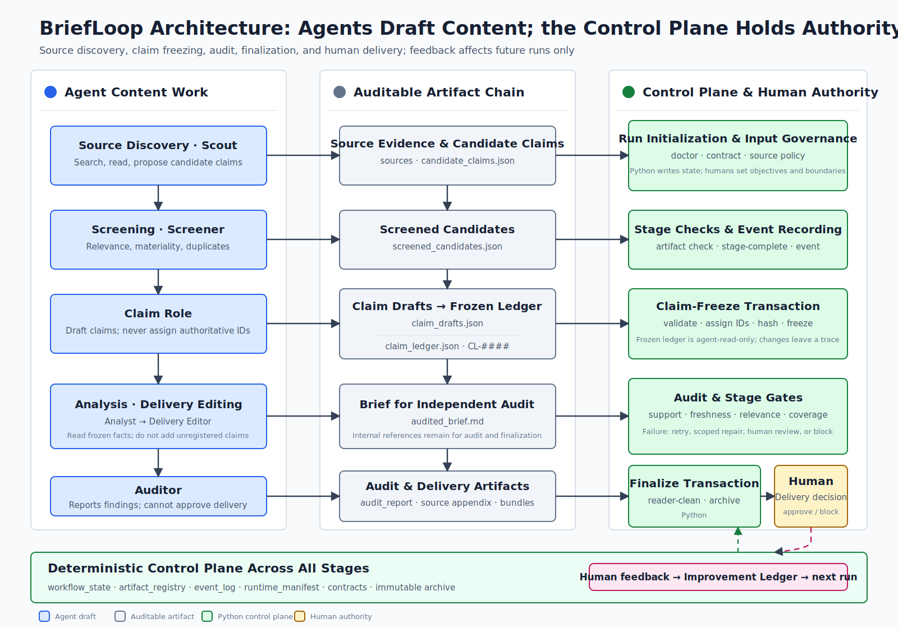

# BriefLoop: Open-Source Loop Engineering for Auditable Business Briefings

## Architecture Reference v0.4.0: The Product Baseline Toward v1.0

**Code snapshot:** v0.11.12 (tag `65b384c06bccffbb183a76db1260def02853b951`)
**Branch:** `main`
**Report date:** 2026-07-10

> **Version boundary.** This report describes the implementation state at immutable tag `v0.11.12` (`65b384c06bccffbb183a76db1260def02853b951`). Versions v0.6.x through v0.8.3 established the traceability spine: runtime state, claim freezing, stage gates, the Improvement Ledger, and immutable archives. Versions v0.9.x added experimental Atomic Claim Graph, Evidence Span Registry, Claim-Support Matrix, and semantic-assessment proposal surfaces. Versions v0.10.x through v0.11.x added product-layer capabilities such as report types, templates, policy profiles, the Quality Panel, and delivery bundles. `docs/architecture-status.md` and `docs/support-matrix.md` remain authoritative for support status. The v0.11.12 snapshot contains no qualifying first-user evidence record; the later `docs/v1-pilot-evidence.md` file is a post-snapshot tracking surface. Approaching 1.0 does not prove output quality or management readiness.

## Abstract

BriefLoop is an open-source loop-engineering system for recurring business briefings. It does not treat an AI-assisted report as a one-shot document. It treats the report as a governed release artifact whose claims, evidence, failures, repairs, and delivery decisions should be inspectable, traceable, and reviewable.

At v0.11.12, BriefLoop has an implemented traceability spine and a v0.11.0 product baseline: three workspace entrypoints (`industry-weekly`, `management-monthly`, and `document-review`); a five-step authoring path (`new`, `run`, `status`, `feedback`, and `deliver`); a delegated Hermes runtime; a host-agnostic operator handoff; 25 publicly reproducible evaluation cases; and more than 2,767 deterministic tests that do not call an LLM in continuous integration. The Python control plane freezes claim drafts into an authoritative Claim Ledger. Runtime state, the Artifact Registry, the Event Log, stage gates, immutable archives, audience snapshots, per-run improvement-memory snapshots, provenance projections, and human-triggered delivery form the accountability spine.

Beginning with v0.9, BriefLoop has advanced support sufficiency through experimental control surfaces: the Atomic Claim Graph, Evidence Span Registry, Claim-Support Matrix, proposal-only Semantic Assessment Report, human adjudication records, persistent source evidence packs, and evidence-span seeding for UTF-8 text. These surfaces can record structure, reference relationships, and human-adjudicated proposals. They cannot prove semantic truth automatically, write support conclusions on their own, or authorize release.

The v0.10-v0.11 product layer adds `report_spec.yaml`, ReportPacks, ReportTemplates, PolicyProfiles, the Quality Panel, Quality Summary, a static HTML audit attachment, template-conformance diagnostics, support-wording diagnostics, reader delivery bundles, and audit bundles. These capabilities provide workspace configuration, read-only projections, and rendering discipline. They do not constitute a second gate system and do not provide semantic proof.

The goal of v1.0.0 is to freeze the product promise and obtain first-user evidence, not to expand the experimental surface. The v0.11.12 snapshot contains no qualifying first-user evidence record; the post-snapshot tracking file still records `not_satisfied`. BriefLoop-090 and its frozen historical experiment identifier `MABW-080` exist only for archived measurement and reproducibility; they are not part of the ordinary user path.

> **What changed in this edition.** v0.4.0 updates the implementation baseline from v0.8.3 to the immutable v0.11.12 tag, adds the support-sufficiency experimental stack, product layer, reference runs, and a post-snapshot first-user evidence pointer, and incorporates Weng's 2026 retrospective synthesis of Harness Engineering research. Weng's article establishes research context; it is not experimental evidence for BriefLoop's output quality or self-improvement. Mechanism and performance claims remain grounded in primary papers such as LIFE-HARNESS and Self-Harness.

> **Naming convention.** BriefLoop is the project's only current name. Historical literals may remain in old commands, schemas, archive filenames, and experiment IDs for compatibility or reproducibility. They are not alternate product names. See `docs/briefloop-naming.md`.

## 1. Core Insights

### 1.1 Architecture Charters

The following principles were extracted from failures in real runs. They are engineering constraints, not slogans.

1. **Smart components have no authority; authoritative components are deterministic; effective changes pass through people; exceptional actions leave a trace.** LLMs and agents may interpret, recommend, decompose, and draft. They may not directly write authoritative state, advance a stage, freeze evidence, pass a gate, or approve delivery. Effects must be executed by the deterministic control plane, confirmed where required by a human, and recorded.
2. **What machines can enforce should not be delegated to memory.** Rules that can be checked through schemas, validators, gates, transactions, events, or tests must not exist only in prompts or handoff prose.
3. **Every field has one writer.** Python writes state, ledgers, events, hashes, gates, and archives. LLMs write content drafts. Humans approve preferences and delivery decisions. Derived projections may not overwrite authoritative records.
4. **A source is not support; traceability is not proof.** Retrieval plans, source candidates, search summaries, and model summaries are discovery material. Whether a source supports a claim must be recorded separately by support strength, source tier, scope, and freshness.
5. **Frozen artifacts cannot be silently rewritten, and gaps cannot be hidden.** Legitimate change must create a new revision, artifact, event, or explicit supersession, revert, or contamination record. Failed gates, missing evidence, rejected claims, and unresolved human decisions must remain queryable.
6. **Conflicts are resolved by declared precedence, not by model persuasion.** Fact contracts and deterministic gates outrank style preferences; repairs for the current run outrank cross-run taste memory; changes to objective, audience, time window, source policy, or delivery standard require explicit configuration or a new run.
7. **Cross-module invariants must close structurally.** When a rule spans transactions, state recomputation, registries, gates, projections, and runtime adapters, it needs one authoritative record and coverage over every writer, recomputer, and reader. The system cannot rely on each path independently remembering the same fact.

### 1.2 Operating Disciplines

- **Product spine: acceleration must not remove accountability.** BriefLoop may reuse frozen evidence, avoid repeated reasoning, and parallelize independent work. It may not remove ledgers, gates, approvals, events, snapshots, or archives to run faster.
- **Public claims: do not say more than the artifacts can support.** Unmeasured capabilities must be labeled unmeasured. Traceability must not be described as semantic proof or demonstrated quality improvement.
- **Data boundary: private facts cannot validate a public mechanism.** Real business workflows may contribute failure categories and test shapes, but private business facts, customer materials, employer data, and non-public information must not enter the public repository, fixtures, or demos.

### 1.3 Why Coding Agents Improve Faster

The progress of coding agents comes not only from stronger models but also from the closed feedback loops already present in software engineering:

| Software-engineering mechanism | Improvement signal |
|---|---|
| Test suite | Explicit pass or fail |
| Git history | Author, rationale, and diff for each change |
| Defect-to-commit trace | The change that introduced a failure can be located |
| Continuous integration | Automated validation before merge |
| Code review | Important changes receive human approval |

Models provide capability; infrastructure provides repeatable feedback. Business briefing rarely has equivalent machinery. Quality defects are difficult to turn into tests, stale data is difficult to locate in the retrieval chain, verbal feedback does not accumulate, and “this section feels wrong” rarely becomes a reusable engineering task. Improvement therefore depends on individual craft and remains difficult to transfer.

### 1.4 The BriefLoop Thesis

BriefLoop does not attempt to make one model intrinsically smarter. It brings software-engineering accountability infrastructure to business briefing:

| Software-engineering mechanism | BriefLoop counterpart |
|---|---|
| Test suite | Artifact validation and stage quality gates |
| Git history | Decisions, timestamps, actors, and reasons in `event_log.jsonl` |
| Defect trace | Producer stage, role, and artifact relationships in `artifact_registry.json` |
| Continuous integration | Orchestrator control loop and stage-completion transactions |
| Code review | `request_human_review`, RepairPlan, human adjudication, and the Improvement Ledger |

The v0.7.1 reference run exposed a decisive failure: the agent completed the content pipeline while almost entirely skipping the control pipeline. It produced eight content artifacts but invoked no decision transactions, ran no gates, and left `workflow_state.json` at its initial stage. In its postmortem, the agent acknowledged that it had treated the Orchestrator contract as background information rather than an API it was required to execute.

That failure drove BriefLoop to move critical bookkeeping from prompts into transactions. Agents still propose what to do and explain why. The Python control plane determines whether a decision has taken legal effect under the required conditions and artifacts. Important rules must live in schemas, validators, gates, transactions, events, or tests rather than instructions alone.

### 1.5 Independent Convergence with Harness Engineering

Between May and July 2026, two empirical studies and one research synthesis provided external coordinates that converge with BriefLoop from different directions.

- **LIFE-HARNESS (Xu et al., 2026)** evolves structured runtime harnesses from training trajectories and applies them to frozen models. Across 18 model backbones and 126 model-environment combinations, 116 combinations improved, with a mean relative gain of 88.5%. Its four layers are organized by intervention point in the agent lifecycle; BriefLoop's four contract categories are organized by governance domain. These are different axes and should not be forced into a one-to-one mapping.
- **Self-Harness (Zhang et al., 2026)** uses a loop of failure mining, bounded modification proposals, regression validation, and acceptance or rejection. It improves held-out Terminal-Bench pass rates across three model families in an environment with deterministic rewards. This supports treating the harness as an optimization object, but it does not establish that open-domain briefing quality will improve.
- **Weng (2026)** defines a harness as the system around a foundation model that orchestrates execution, planning, tool use, context management, artifact storage, and outcome evaluation. She describes the research progression as prompts, structured context, workflows, harness code, and optimizer code. This is a research synthesis and technical essay, not a peer-reviewed evaluation of BriefLoop. [Original article](https://lilianweng.github.io/posts/2026-07-04-harness/)

The chronology also matters. BriefLoop's human-gated Improvement Ledger and per-run snapshots entered v0.7.0 on 2026-06-10, and its Python-owned claim-freeze transaction entered v0.8.3 on 2026-06-16, both before Weng's synthesis. The defensible description is therefore **retrospective independent convergence**: Weng provides a unifying research language and risk boundary, while BriefLoop's repository history shows an early engineering instance of these principles in open-domain business briefing. Chronology does not substitute for evaluation and does not establish priority or performance superiority.

### 1.6 From Agent Engineering to Loop Engineering

Loop Engineering is not about writing a better prompt once. It is about designing a system that repeatedly discovers tasks, assigns work, checks outcomes, records state, and decides what happens next. BriefLoop applies this method to recurring business briefings. Its control units are not code diffs but material claims, evidence spans, support records, `FeedbackIssue` records, repair tasks, and delivery decisions.

| Loop-engineering element | Coding context | BriefLoop context |
|---|---|---|
| Scheduled discovery | Periodic issue scanning | Weekly reports, monthly reports, recurring research |
| Isolated workspace | Git worktree | Independent run workspace |
| Skills | Repository-level `SKILL.md` | Audience profile, policy profile, role contracts |
| Connectors | Issue tracker, database, API | Source providers and delivery connectors |
| Subagents | Producer and checker separation | Author and auditor separation |
| Persistent memory | Files and commit history | Improvement Ledger, Claim Ledger, Event Log |
| Validation | Unit and regression tests | Quality gates and same-evidence regression |
| Human review | Pull Request review | Human adjudication and delivery approval |

## 2. Design Philosophy

### 2.1 A Three-Layer Quality Model

BriefLoop separates quality into three layers so that process compliance, clean delivery, and analytical excellence are not conflated.

1. **Law:** Machine-checkable requirements such as citation presence, source freshness, numerical consistency with the ledger, and absence of internal identifiers in the reader edition. Hashes, events, and gate reports can verify this layer, but only for formalizable defects.
2. **Honesty:** Whether the reader artifact is clean, readable, and free of internal workflow residue or blank citations. This measures delivery discipline, not analytical depth.
3. **Wisdom:** Whether the briefing identifies what truly matters, provides insight, and outperforms a single-model baseline. This remains **NOT MEASURED**. Claim-layer artifacts differ across runs, so causal attribution is not yet valid.

The correct sequence is to stabilize Law first, then Honesty, and only then measure Wisdom against controlled baselines. Content-quality comparisons are heavily confounded while delivery itself remains unstable.

### 2.2 Correctness, Taste, and Evidence

| Dimension | Concern | Governance mechanism | Authoritative writer |
|---|---|---|---|
| Correctness | Factual errors, stale data, attribution mismatch, structural violations | Schemas, stage validation, deterministic gates | Python control plane |
| Taste | Department preferences, cultural norms, implicit audience expectations | Audience Profile and human-approved Improvement Ledger | Human; model interprets and applies |
| Evidence | Source-claim binding, support strength, freshness, authority tier | Claim drafts, frozen ledger, evidence spans, source appendix | Model drafts; Python freezes and validates |

Correctness can be partly mechanized. Taste must remain human-editable. Evidence lies between them. Models may discover and draft claims, but claim IDs, freeze records, hashes, and support metadata must be owned by the deterministic control plane.

### 2.3 Governance Domains and Control Surfaces

Four contract categories answer **what is governed**:

| Contract category | Governance scope |
|---|---|
| Behavior | Authority boundaries for the Orchestrator and specialist roles |
| Process / Artifact | Stage readiness and expected artifacts |
| Fact-Grounding / Evidence | Whether material claims trace to registered evidence |
| Quality / Audience | Whether delivery meets reader and quality requirements |

Control surfaces answer **who writes, when the result freezes, how it is validated, and what happens on failure**. The contract categories and the control surfaces are therefore not competing architectures. The former describes governance content; the latter realizes that content as files, writers, transactions, and failure states. See `docs/control-surfaces.md` for the field-level inventory.

### 2.4 The Single-Writer Principle

- Python writes control state, ledgers, events, hashes, gates, transactions, and archives.
- Runtime agents write candidate claims, screening results, claim drafts, brief content, and semantic audit opinions.
- Humans write approvals, audience guidance, delivery decisions, and explicit run direction.

The separation between `claim_drafts.json` and `claim_ledger.json` exists to enforce this rule. The model may write drafts without authoritative IDs. Python assigns stable IDs and freezes the ledger. Neither side may opportunistically rewrite the other's artifact.

### 2.5 The Speed Principle

Speed may come from reusing frozen artifacts, reducing repeated reasoning, and parallelizing independent work. It may not come from weaker records, fewer gates, fewer approvals, or weaker archives. A fast rerun imports and validates an existing fact layer, then resumes from analysis. It still performs writing, audit, gates, finalization, and human delivery. Acceleration comes from reuse, not omission.

## 3. Architecture: Five Control Spines



*Figure 1. Agents perform content work; the deterministic control plane owns state, freezing, gates, and archives; humans retain critical authorization and final delivery.*

### 3.1 Runtime-State Spine

```text
runtime_manifest.json
→ workflow_state.json
→ artifact_registry.json
→ event_log.jsonl
```

The Python control plane is the sole writer. Every run creates a complete state record under `output/intermediate/`. The run-integrity module distinguishes clean, contaminated, and recorded-repair states. Resetting an executed run, replaying a stage against stale state, or changing a frozen artifact must create a contamination event. Timing is projected from the Event Log; the system does not fabricate precise model-runtime measurements.

### 3.2 Evidence-and-Claim Spine

```text
source evidence
→ persistent source evidence
→ input classification
→ candidate_claims.json
→ screened_candidates.json
→ claim_drafts.json
→ freeze transaction
→ claim_ledger.json
→ audited_brief.md
→ audit_report.json
→ source_appendix.md
```

Runtime agents produce candidates, screening results, claim drafts, and briefing content. Python validates and freezes the boundary between `claim_drafts.json` and `claim_ledger.json`.

The claim-freeze transaction proceeds as follows:

1. The claim role writes `claim_drafts.json` without `claim_id`. A preassigned ID at any nesting level is rejected.
2. `briefloop state freeze-claim-ledger` reads validated drafts, assigns `CL-####` in deterministic order, writes the authoritative `claim_ledger.json`, records hashes and freeze metadata, and appends a `claim_ledger_frozen` event.
3. `briefloop state stage-complete --stage claim-ledger` requires a matching freeze record. Hash drift, missing freeze metadata, or stale ledger bytes fail closed.
4. Analyst and auditor roles read only the frozen ledger. They may not treat the draft as authoritative input or modify the ledger.

### 3.3 Gate Spine

```text
CompositeAuditAgent
├── DeterministicAuditAgent
├── QualityHarnessAuditAgent
└── NoOpSemanticAuditAgent
    → gates/auditor_quality_gate_report.json
    → gates/finalize_quality_gate_report.json
```

The first two audit components are Python implementations and do not call an LLM. The semantic-audit slot remains a placeholder. The runtime Auditor is expected to examine whether wording matches support strength, but the project does not ship a model-based semantic auditor with release authority. Auditor and finalize stages consume their own stage-scoped gate reports. The legacy `quality_gate_report.json` is a compatibility projection, not frozen authority.

### 3.4 Memory-and-Improvement Spine

```text
audience_profile.md
→ audience_profile_snapshot.md

improvement/ledger.jsonl
→ improvement/memory.md
→ improvement_memory_snapshot.md
```

Humans maintain the Audience Profile and approve improvement guidance. Python materializes memory from the ledger, freezes the per-run snapshot, and records effective entries and their SHA-256 in the Runtime Manifest. An approval or revert during a run affects only future runs; it cannot alter already-frozen input for the current run. Each ledger revision links to its predecessor hash.

### 3.5 Delivery-and-Archive Spine

```text
output/delivery/brief.md
output/delivery/<name>.docx
output/source_appendix.md
output/runs/<run_id>/
output/intermediate/finalize_report.json
```

The Python finalization transaction produces reader artifacts from the audited brief, removes or transforms internal citation markers, appends reader-visible source information, and renders DOCX. `output/source_appendix.md` remains the audit/control copy. Each completed run archives delivery artifacts, intermediate artifacts, control records, and a hash manifest. The live `output/` tree may advance; a historical run may not be overwritten.

### 3.6 Product Layer and Support-Sufficiency Experimental Stack

```text
report_spec.yaml
→ ReportPack / ReportTemplate / PolicyProfile
→ atomic_claim_graph.json
→ evidence_span_registry.json
→ claim_support_matrix.json
→ semantic_assessment_report.json
→ semantic_support_acceptance_ledger.json
→ quality_panel.json / quality_summary.md / quality_panel.html
→ delivery_bundle.zip / audit_bundle.zip
```

Authority is bounded as follows:

- Specialist roles may draft atomic claims, evidence spans, support-matrix rows, and semantic-assessment proposals.
- Python validates only schemas, reference integrity, hash bindings, required-row coverage, and adjudication-record format.
- `semantic-support adjudicate` records human acceptance or rejection; the adjudication record does not rewrite the Claim-Support Matrix automatically.
- `briefloop new`, `packs bundle`, `quality summarize`, `extract`, and `sources materialize-pack` write workspace structure or projections. They do not run specialist roles, approve delivery, or prove semantic correctness.

The supported product entrypoints are:

| User command | Internal ReportPack | Purpose |
|---|---|---|
| `briefloop new industry-weekly` | `market_weekly` | Industry weekly report |
| `briefloop new management-monthly` | `management_monthly` | Management monthly report |
| `briefloop new document-review` | `evidence_extract` | Document evidence-extraction workspace |

## 4. Control Transactions

### 4.1 Stage-Completion Transactions

`stage-complete` and `finalize-complete` move stage bookkeeping from a prompt obligation into deterministic execution. A transaction:

- checks that expected artifacts are registered and valid in `artifact_registry.json`;
- updates the stage status in `workflow_state.json`;
- appends a completion event to `event_log.jsonl`;
- enforces stage-specific preconditions, such as a matching freeze record for Claim Ledger completion.

The Orchestrator decides what action to take and why. Python records whether that decision has legally taken effect under the required conditions.

### 4.2 Claim-Ledger Freeze Transaction

| Operation | Authoritative writer | Artifact or result |
|---|---|---|
| Draft claims | Claim role | `claim_drafts.json`, without `claim_id` |
| Validate drafts | Python | Reject preassigned IDs and invalid structure |
| Assign IDs | Python | Stable `CL-####` identifiers |
| Freeze ledger | Python | `claim_ledger.json`, freeze metadata, and event |
| Complete stage | Python | Refuse completion without a matching freeze record |

After freezing, analyst and auditor roles may only read the ledger. Any change requires a new run or an explicit contamination, supersession, and repair record.

### 4.3 Run Integrity and Contamination

`workflow_state.json.run_integrity` records whether a run remains usable as clean reference evidence. Resetting an executed run, replaying a stage against stale state, or modifying a frozen artifact writes a `run_integrity_contaminated` event and reason. A contaminated run may continue to a constrained delivery, but it may not be presented as an A-grade controlled experiment.

### 4.4 Immutable Archives

The archive at `output/runs/<run_id>/` preserves:

- delivery artifacts such as Markdown and DOCX;
- intermediate artifacts such as the Claim Ledger, gate reports, and audit report;
- control records such as workflow state, Event Log, and Runtime Manifest;
- SHA-256 values for every artifact in the manifest.

The archive is append-only and cannot be rewritten in place.

### 4.5 Fast-Rerun Import

`briefloop state import-fact-layer` can copy archived source evidence, input classification, candidate claims, screening results, and the Claim Ledger into a new workspace. The transaction copies original bytes, verifies hashes, records the import relationship, and marks satisfied upstream stages as completed by import. `briefloop run --recipe fast-rerun` begins at analysis. Finalization still reevaluates freshness against the new workspace's time. A fast rerun reuses the fact layer; it does not reuse the previous brief, audit result, finalization record, or delivery approval.

## 5. Evidence and Claim Governance

### 5.1 From Source to Claim

```text
source discovery
→ persistent source evidence
→ input classification
→ candidate claims
→ screening results
→ claim drafts
→ deterministic freeze
→ Claim Ledger
```

Only materialized source files and supported entries in source configuration can serve as evidence. `source_candidates.yaml` is for planning and review. It cannot replace `sources.yaml`, and its presence does not establish that source discovery is complete. Retrieval plans, search summaries, and model summaries are discovery material, not evidence.

Current source records require at least a source ID, name, type, title, and content. Evidence spans, retrieval time, source tier, and excerpt hashes belong to the support-sufficiency direction. They strengthen traceability but still do not prove automatically that a source semantically supports a claim.

### 5.2 Claim-Draft Contract

`claim_drafts.json` is the input to the claim-freeze transaction. Neither a draft entry nor its metadata may contain a preassigned `claim_id`. The `sorted_sequential_v1` algorithm sorts by stable keys and assigns `CL-####`. Identical freeze input produces identical IDs, but the system does not promise ID stability across freezes when claims are added, removed, or reordered.

This design prevents the model from fabricating authoritative identity. The model owns claim content; the system owns claim identity and freeze status.

### 5.3 Support-Strength Calibration

The v0.7.4 failure study exposed five recurring problems:

1. **Support inflation:** a source reports regulatory discussion, while the brief describes formal approval.
2. **Authority inflation:** a conference item or media report is presented as a government plan or official fact.
3. **Claim conflation:** a supported core fact and an unverified implication appear in the same sentence.
4. **Attribution mismatch:** one source is made to carry several conclusions it does not independently support.
5. **Forecast-as-evidence:** a secondary-market forecast or commentary is used as the basis for a core fact.

These are not missing-source failures. They are calibration failures between evidence and language. The Auditor must examine overstatement, support strength, confidence, evidence relationships, and limitations. Experimental support records may use labels such as `explicitly_supported`, `partially_supported`, `supportive_but_overextended`, `attribution_mismatch`, `needs_primary_source`, and `unsupported`. The labels still require human adjudication and cannot become release authority on their own.

### 5.4 Boundary of the Source Appendix

During finalization, `output/source_appendix.md` is generated from claims actually cited by the reader brief. It is embedded into Markdown and DOCX delivery artifacts while an audit copy is retained. The Source Appendix gives readers a route for follow-up. It is not a certificate of factual correctness. It establishes where a claim can be traced, not that the claim has been proven true.

## 6. Gates and Repair

### 6.1 Stage-Scoped Gates

| Gate report | Constrained stage | Primary checks |
|---|---|---|
| `gates/auditor_quality_gate_report.json` | Auditor completion | Material facts, freshness, target relevance, coverage omissions |
| `gates/finalize_quality_gate_report.json` | Finalize completion | Reader residue, internal IDs, process language, delivery hygiene |

Stage-scoped reports are authoritative. The legacy `quality_gate_report.json` is retained only as a compatibility projection. Completion transactions have no `--force` path around the gates.

### 6.2 Deterministic Audit Stack

```text
runtime Auditor role
→ CompositeAuditAgent
→ DeterministicAuditAgent
→ QualityHarnessAuditAgent
→ NoOpSemanticAuditAgent
→ audit_report.json
```

The deterministic audit checks sources, freshness, numbers, dates, safe wording, process residue, and redaction. The Quality Harness audit checks rules around material facts, target relevance, and reader residue. The semantic-audit slot remains a placeholder. A future model-based semantic evaluator still may not overwrite deterministic findings or decide support truth or delivery eligibility by itself.

### 6.3 Repair Routing

`briefloop repair route` is a read-only diagnostic command. It maps gate, audit, registry, and workflow findings to the responsible stage and allowed artifact class. It tells the Orchestrator who should repair an issue and what may be changed. It does not create prose, execute repair, or replace a RepairPlan.

### 6.4 Anti-Goodhart Principle

*Precision Is Not Faithfulness* shows that optimizing precision alone may reward a system for deleting important but difficult-to-verify content. Before a blocking precision gate is introduced, BriefLoop must ask: **What is the cheapest way for the system to pass?** If omission is the cheapest strategy, a coverage or omission check must accompany the gate so that silence cannot earn a high score.

### 6.5 Coverage and Omission Continuity

The current supported gate checks whether high-priority items in `screened_candidates.json` disappear silently before the Claim Ledger or cited brief. It captures the path in which an item passes screening but is omitted during analysis or editing. It does not provide complete recall over all relevant facts and does not prove that the report has sufficient overall coverage.

## 7. Controlled Memory and Improvement

### 7.1 Audience Profile

`audience_profile.md` is a human-editable workspace file for structural preferences, departmental vocabulary, tone, and durable feedback. A run reads only its frozen `audience_profile_snapshot.md`. Changes to the live profile during a run affect future runs only. The profile is semantic guidance, not evidence, and has no gate authority.

### 7.2 Improvement Ledger

`improvement/ledger.jsonl` is an append-only, revision-chained workspace ledger that requires human approval. Its lifecycle is:

```text
propose
→ human approve
→ Python rebuilds improvement/memory.md
→ next run freezes improvement_memory_snapshot.md
→ revert when necessary
```

Key invariants are:

- a proposed entry affects no run;
- approval appends state and does not alter the current run;
- materialization occurs at the beginning of the next run;
- reverted entries disappear from the next memory and snapshot;
- `materialized_entry_ids` and the hash in `runtime_manifest.json` record exactly which guidance the run consumed.

### 7.3 Whether Guidance Was Manifested

The experimental `guidance_manifestation_report.json` can record observable status for approved guidance in an output: explicitly manifested, partially manifested, contradicted, or not observable. Python validates labels and counts them. It does not decide whether a label is semantically correct, modify improvement memory, or block finalization.

The archived BriefLoop-090 experiment can import manifestation ratings from an external evaluator. That measurement is outside the ordinary product path and does not establish improved output quality.

### 7.4 Memory Surfaces Not Yet Shipped

| Planned artifact | Status | Purpose |
|---|---|---|
| `improvement/intake.jsonl` | Deferred | Receive raw feedback with source relationships |
| `improvement/candidates.jsonl` | Deferred | Stage unapproved rule or preference candidates |
| `reference_samples/manifest.jsonl` | Planned | Preserve human-accepted examples of taste |

These surfaces should be introduced only after the core propose-approve-materialize-freeze-revert lifecycle is stable.

### 7.5 Controlled Harness-Improvement Protocol (Proposed)

v0.11.12 has event traces, gate findings, `FeedbackIssue`, `RepairPlan`, evaluation fixtures, the Improvement Ledger, and run snapshots, but it does not yet implement end-to-end harness self-improvement. A future protocol must preserve these authority boundaries:

| Phase | Permitted action | Authority constraint |
|---|---|---|
| Observe weaknesses | Form structured candidates from events, gates, audits, and human feedback | Observation does not become modification automatically |
| Propose a bounded change | An agent proposes a narrow modification for a repeated, localizable issue and declares editable scope and behavior to preserve | The agent cannot write the active harness |
| Regression validation | Held-in cases confirm the target issue is fixed; held-out cases and same-evidence reruns check side effects | Evaluators and permission controls stay outside the editable loop |
| Authorization | A human accepts or rejects; a deterministic transaction records inputs, version, outcome, and decision | Only an approval transaction may create a candidate new version |
| Activation | The new version affects future runs only; rejected proposals and negative outcomes remain recorded | No writeback into the current run or frozen historical runs |

“Improvement” in BriefLoop therefore does not mean an agent rewriting its own control plane. It means converting production failures into engineering changes that are localizable, proposable, regression-tested, approvable, and reversible. Materiality, analytical taste, and management value still require human judgment. Deterministic gates provide only local, auditable weak-reward surfaces.

## 8. Implementation Baseline at v0.11.12

### 8.1 Version Evolution

| Version | Theme | Core capability boundary |
|---|---|---|
| v0.8.3 | Claim-freeze transaction | Python assigns stable IDs to draft claims and freezes them |
| v0.9.0-v0.9.3 | Experimental support-sufficiency core | Atomic Claim Graph, Evidence Span Registry, Claim-Support Matrix |
| v0.9.4 | Semantic-assessment proposals | Semantic Assessment Report, input binding, human adjudication records; no support-truth writes |
| v0.10.x | Product layer and delivery hardening | Report specification, bundle projections, finalization transaction, five-step authoring path |
| v0.11.0 | Product baseline | Three `briefloop new` entrypoints, policy profiles, templates, wording diagnostics |
| v0.11.12 | Runtime and operator surfaces | Operator runtime, human semantic adjudication, and the source-clone WorkBuddy Skill bundle |
| v1.0.0 (target) | Product freeze | Freeze commitments and satisfy first-user evidence; do not expand scope by default |

### 8.2 Supported

- Default and strict specialist-role topologies, plus Delivery Editor.
- Hermes, Claude Code, OpenCode, and operator runtimes.
- Runtime state, artifact registration, Event Log, claim freezing, stage-completion and finalization transactions, contamination records, and immutable archives.
- Auditor and finalize stage gates, including coverage-and-omission continuity.
- Deterministic audit, repair routing, feedback and RepairPlan commands, and the Orchestrator control switchboard.
- Improvement Ledger, audience snapshots, per-run improvement snapshots, and provenance projection.
- Reader delivery under `output/delivery/`, audit copies of the Source Appendix, and transactional delivery promotion.
- Four-way input governance and market-competition, policy, and regulatory-analysis modules.
- 25 public-safe evaluation cases and more than 2,767 deterministic tests.
- The `industry-weekly`, `management-monthly`, and `document-review` product entrypoints.

### 8.3 Experimental

- Atomic Claim Graph, Evidence Span Registry, Claim-Support Matrix, semantic assessment, and human adjudication.
- ReportTemplate rendering, PolicyProfile gate adaptation, Quality Panel, materiality diagnostics, and support-wording diagnostics.
- UTF-8 evidence-span seeding, persistent source evidence packs, and SourceHub Lite setup.
- Fast-rerun fact-layer import.
- MinerU input extraction and experimental paths for Codex, the source-clone WorkBuddy Skill bundle, Feishu, and PDF.
- Archived experiment tooling for BriefLoop-090 and its frozen historical ID `MABW-080`.

### 8.4 Not Shipped

- An end-to-end Issue Candidate system.
- A complete coverage gate with release-blocking authority.
- A semantic-regression harness with release authority.
- A release-eligibility summary.
- LLM prose scoring, private commercial benchmarks, or autonomous learning.
- The improvement-feedback intake and candidate-promotion pipeline.
- A primary `pipx install briefloop` path validated against a real published artifact.

### 8.5 v1.0 Evidence Gate

The freeze inventory in `docs/control-surfaces.md` identifies surfaces eligible for backward-compatibility commitments. v1.0 also requires at least one publicly reproducible first-user evidence record, such as an external fresh clone, first use through WorkBuddy, a pilot checklist, or recurring weekly-report dogfood. The v0.11.12 snapshot contains no such record; the later `docs/v1-pilot-evidence.md` file is a post-snapshot tracking surface and still records `not_satisfied`.

BriefLoop-090 completed one synthetic `auditable_brief` pilot. It can support the narrow statement that guidance patterns differed in one case. It cannot support generalized claims about output quality, management readiness, or delivery quality.

## 9. Reference Evidence and Failure Studies

### 9.1 v0.7.2 Public Solar Integration Run

Two runs over public materials demonstrated that the following mechanisms can close end to end:

- approved guidance can be materialized into frozen per-run improvement memory;
- quality gates blocked stage progression three times and passed after repair;
- the Orchestrator reads a frozen snapshot rather than live mutable workspace memory;
- `runtime_manifest.json` records effective entry IDs and their hashes.

The run does not prove improved output quality or a causal effect from guidance. Candidate claims, screening results, and Claim Ledger hashes differed between the two runs, so guidance was not the only variable. The run is appropriate as B+ integration evidence, not as an A-grade controlled experiment.

### 9.2 v0.7.4 Failure Study

An industry-research run produced a complete, readable briefing and preserved the full workflow artifact chain. External review still found support inflation, authority-tier mismatch, claim conflation, attribution mismatch, and forecasts presented as facts.

This did not show that BriefLoop produced a better report. It demonstrated a narrower but important capability. In direct model drafting, an error often survives only in the final text. In BriefLoop, the error can be traced through source summary, candidate claim, screening result, Claim Ledger, audited brief, and reader artifact. The failure was not repaired automatically, but its propagation path was preserved.

### 9.3 Decoupling Content and Control

The v0.7.1 run showed that a model can complete all content work while skipping almost every control obligation. That failure directly motivated stage-completion, finalization-completion, and claim-freeze transactions. It supports one conclusion: **a prompt obligation is not an execution guarantee.** An important rule needs a machine-verifiable execution path.

### 9.4 Evidence Boundaries

| Evidence | Supports | Does not support |
|---|---|---|
| Solar B+ run | Gates executed; Improvement Memory chain closed | Improved output quality; causal guidance effect |
| Failure study | Error-propagation path preserved; failures classifiable | BriefLoop outperforms a single-model baseline |
| Content/control decoupling | Models are poor owners of low-level authoritative bookkeeping | Every model will fail in the same way |
| BriefLoop-090 | Observable guidance-pattern differences under one frozen fact layer | Generalized quality, management readiness, or DOCX quality |

### 9.5 Synthetic Pilot and Product-Layer Reference Bundle

BriefLoop-090 uses one public-safe synthetic case with three conditions: `baseline`, `memory`, and `prompt-only`. It applies blind assessment and hash-bound import. The observation matched the intended pattern: the baseline did not manifest the target guidance, the memory condition was more stable, and prompt-only over-applied the same guidance. This result is specific to one case.

The v0.11.3 product-layer reference bundle demonstrates deterministic `same_evidence_reader_quality_regression`: the reader artifact contains no internal claim markers, the audit bundle preserves trace records, and the Quality Panel summarizes materiality, template, wording, and trajectory diagnostics. The bundle does not call a model, so it cannot establish model-output quality or delivery approval.

## 10. Related Research and Industry Practice

### 10.1 Harness Adaptation and Optimization

LIFE-HARNESS and Self-Harness both show that the interface layer between a model and its environment can be an independent optimization target. The former evolves runtime interventions in environments with clear binary rewards. The latter uses failure mining, bounded proposals, and held-in/held-out regression. BriefLoop operates in open-domain briefing, where reward is sparse, subjective, and often encoded only in human experience. It therefore cannot copy automated evolution directly. It needs structured human feedback, external evaluators, permission boundaries, and frozen cross-run comparisons.

Weng's 2026 synthesis expands the harness into an operating system composed of workflows, context lifecycle, persistent state, tools, subagents, permissions, and evaluation. It also stresses that recursion alone does not guarantee improvement; vague evaluation, reward hacking, and long-horizon maintenance remain unresolved; evaluators and permission controls should remain outside the editable loop; and people should move up to critical decision points rather than disappear.

BriefLoop has a supported subset of trajectory regulation. When retries, repair loops, or repeated blocks exceed budget, Python narrows the legal decisions for the current stage to `request_human_review` and `block_run` and records the change in the Event Log. This is control-state narrowing, not automated repair.

### 10.2 Multi-Turn Feedback and Regression

DRA Multi-Turn finds that model self-reflection provides little net benefit, while process-level feedback can produce meaningful single-turn gains; later revision can nevertheless regress constraints that were previously satisfied. This supports targeted repair, frozen snapshots, and external gates. It also explains why same-evidence regression must check both whether the target defect disappeared and whether previously passing behavior was preserved.

### 10.3 Auditable Human-Agent Collaboration

CHAP describes human-multi-agent collaboration through workspaces, tasks, artifacts, and append-only evidence logs. CHAP focuses on the communication protocol; BriefLoop focuses on governance and release accountability inside enterprise briefing. Both require collaborative results to land in inspectable artifacts rather than exist only in transient conversation.

### 10.4 Evaluation Method

*Precision Is Not Faithfulness* warns that a single precision metric can reward systems for saying less. ResearchLoop argues that an evidence gate must not be executed by the same model it evaluates. BriefLoop keeps freezing, hashing, coverage checks, stage state, and delivery hygiene in a non-model control plane. Semantic judgment remains a proposal or an input to human adjudication.

### 10.5 Multi-Agent Frameworks

AutoGen, CAMEL, MetaGPT, and related systems primarily study communication and division of labor among models. BriefLoop's distinction is not agent count. It lies in contracts, file-backed state, stage transactions, and authoritative writers. Multiple agents are warranted for context isolation, parallel exploration, or clearly specialized responsibilities. Otherwise, coordination cost, maintenance cost, and failure surface may exceed the benefit.

### 10.6 Memory and Preference

BriefLoop's Audience Profile borrows the workspace-level user-file pattern but adds a workspace-local ledger, human approval, per-run freezing, hash chaining, and a manifest of effective entries. Live memory cannot silently alter the current run, preference cannot override fact gates, and projections cannot write back to the source ledger.

### 10.7 Enterprise Knowledge-Work Agents

This section uses official articles and case studies from Anthropic and OpenAI as industry-practice evidence, not peer-reviewed proof. They support the observation that the industry is moving from conversational question answering toward deliverable, auditable, governable knowledge-work systems. They do not establish that BriefLoop is correct or produces higher-quality output.

#### 10.7.1 From Conversation to Deliverables

Claude Cowork product materials position knowledge-work agents as systems that handle multi-source, multi-step, cross-application tasks and produce documents, spreadsheets, presentations, and email. Recurring briefing fits this shape: inputs are distributed, output must be delivered, the process repeats, and users generally know what an acceptable result should look like.

#### 10.7.2 Enterprise Analysis Is First a Context and Validation Problem

Anthropic's internal analytics practice identifies concept or entity ambiguity, stale data, and retrieval failure as major error sources. It addresses them with authoritative datasets, semantic layers, lineage graphs, fixed offline evaluation sets, and ablation studies. Kepler's financial-services case likewise constrains the model to one reasoning component in a broader pipeline, while deterministic infrastructure carries validation and traceability.

This division matches BriefLoop: models draft and challenge; Python freezes, validates, records, and gates; evidence spans and support matrices make source-claim relationships explicit; same-evidence reruns reveal whether a change introduced regression.

#### 10.7.3 From Prompts to Operating Harnesses

Agent practice in large codebases shows that enterprise deployment depends on project conventions, automation hooks, skills, plugins, tool connections, permissions, ownership, and review processes, not on the model alone. BriefLoop's contracts, control surfaces, gates, frozen artifacts, Event Log, and human approvals serve an analogous function in briefing.

#### 10.7.4 When Multiple Agents Are Appropriate

Multi-agent systems are most valuable in three cases: isolating subtasks that would pollute the main context, exploring a large search space in parallel, and assigning specialized tools and context to distinct responsibilities. Outside these cases, coordination cost is often high. BriefLoop therefore does not market “more agents” as the contribution. Role topology may change; artifact contracts and control responsibilities do not.

#### 10.7.5 From Quality Governance to Security Governance

Once agents access enterprise tools, risk expands to prompt injection, tool poisoning, identity and permission abuse, memory contamination, and supply-chain attacks. Identity, authorization, revocation, sandboxing, and audit logs become system capabilities. BriefLoop's Improvement Ledger, human approval, frozen snapshots, Event Log, delivery gates, and connector governance function as both quality and security controls.

#### 10.7.6 Production Traceability and Controlled Improvement

OpenAI's Tax AI case describes an improvement loop with three pillars: expert-practitioner correction, production traceability from source material to final filing, and conversion of repeated issues into bounded evaluations and engineering tasks. Not every human edit becomes a code task. Extraction omissions, domain judgment, product boundaries, and workflow noise must first be separated.

This aligns with BriefLoop's target model. Human edits, audit findings, citation mismatches, and support insufficiency first become structured issues. Only repeated, localizable, testable issues enter the repair queue. Self-improvement is not solitary model reflection; it is a production system converting failures into verifiable, approvable engineering work.

| Tax AI practice | BriefLoop counterpart |
|---|---|
| Source document | Source pack |
| Field extraction | Atomic claim extraction |
| Field citation | Evidence span |
| Expert correction | Human adjudication and FeedbackIssue |
| Field-level review row | Support record and `FeedbackIssue` |
| Repeated correction pattern | Evaluation target |
| Bounded code repair | Scoped workflow repair |
| Regression evaluation | Semantic regression and same-evidence rerun |
| Filed result | Human-approved briefing delivery |

## 11. Limitations and Future Work

### 11.1 Known Boundaries

v0.11.12 does not claim to provide:

- automatic proof of semantic truth;
- demonstrated improvement in briefing content quality;
- autonomous repair execution;
- stable manifestation of all guidance across models and runtimes;
- automated fact-checking;
- management-ready deliverables by default;
- an end-to-end self-improving harness.

The precise capability boundary is narrower. Material claims can be connected to registered sources, artifacts, and control records. Optional support records and semantic-assessment proposals can be observed and human-adjudicated. These surfaces provide traceability and support-sufficiency records; they do not provide truth proof.

v0.11.12 does not automatically cluster validator-confirmed weaknesses, does not ship an approval transaction for harness proposals, and has not shown that a modified harness avoids regression on held-out briefing cases. The Improvement Ledger currently manages human-approved reader guidance. It does not authorize agents to change code, contracts, gates, policies, or control state consumed by future runs.

### 11.2 v1.0 Focus

The priority for v1.0 should be to freeze the product promise and obtain first-user evidence, not expand the experimental surface. The product layer already has three workspace entrypoints, report specification, a five-step authoring path, state projections, reader and audit bundles, and the Quality Panel. The next requirement is evidence that a new user can complete a reproducible run in a fresh environment and understand when the system blocks, why it blocks, and which artifacts are authoritative.

### 11.3 Support-Sufficiency Direction

Existing experimental surfaces include the Atomic Claim Graph, Evidence Span Registry, Claim-Support Matrix, semantic-assessment proposals, human adjudication, persistent source evidence packs, and the Quality Panel. The remaining path is:

```text
blocking coverage gate
→ held-in/held-out regression acceptance protocol
→ regression harness with release authority
→ release-eligibility summary
→ Issue Candidate system
```

A semantic model may propose labels, express uncertainty, and explain disagreement. It may not directly decide support truth, repair ownership, archive grade, future-run policy, or release eligibility. Release authority remains in schemas, hashes, policy, human adjudication, and deterministic blocking rules.

### 11.4 From Failure to Improvement

A future Issue Candidate system should follow this path:

```text
report failure
→ claim-level trace
→ structured issue
→ evaluation target
→ scoped repair
→ same-evidence regression
→ human review
→ updated release eligibility
```

Not every correction should enter the engineering queue automatically. Further harness modification also requires four conditions: editable scope is declared in advance; evaluator and permission control remain outside the editable loop; held-in cases show that the target issue is fixed and held-out cases show no regression; and an approved version affects future runs only.

### 11.5 Non-Goals

BriefLoop does not use one global semantic score as release authority, let a model reviewer decide final support truth, ask Python to pretend it has semantic judgment, or weaken ledgers, Event Logs, archives, human delivery, and frozen-artifact rules in the name of speed.

The most accurate public statement is:

> BriefLoop puts the claims, evidence, and delivery decisions in business briefings into an auditable engineering loop. It does not prove truth or eliminate hallucination.

## Appendix A: Contract Categories

`configs/orchestrator_contract.yaml` defines four contract categories:

| Category | Meaning |
|---|---|
| `behavior` | Role authority and behavioral boundaries |
| `process_artifact` | Stage order, readiness, and expected artifacts |
| `fact_grounding_evidence` | Relationships among claims, sources, evidence, and support records |
| `quality_audience` | Quality requirements, reader requirements, and delivery boundaries |

## Appendix B: Decision Vocabulary

The Orchestrator's legal decisions are:

| Decision | Meaning |
|---|---|
| `continue` | Current-stage requirements are satisfied; proceed |
| `retry_stage` | Re-execute the current stage |
| `delegate_repair` | Delegate a bounded repair to the responsible role |
| `request_human_review` | Request human judgment or approval |
| `block_run` | Prevent the run from advancing |
| `finalize` | Enter finalization after audit and gates are satisfied |

Allowed decisions by stage are defined in `configs/stage_specs.yaml`.

## Appendix C: Control-Surface Index

Authoritative control surfaces fall into four groups:

- runtime state: Runtime Manifest, Workflow State, Artifact Registry, and Event Log;
- evidence and correctness: source evidence, Claim Ledger, gate reports, Audit Report, and support records;
- taste and improvement: Audience Profile, Improvement Ledger, frozen snapshots, and manifestation diagnostics;
- delivery and archive: Finalize Report, reader delivery bundle, audit bundle, and immutable run archive.

Field-level authority is defined in `docs/control-surfaces.md` and `src/multi_agent_brief/orchestrator/runtime_state/`.

## Appendix D: Roles and Stages

```text
doctor (Python)
→ source-discovery
→ input-governance (Python)
→ scout
→ screener
→ claim-ledger
→ analyst
→ delivery-editor
→ auditor
→ finalize (Python)
```

The default topology allows Scout to perform both discovery and screening. Strict topology uses an independent Screener. `human_assisted` topology can introduce people at designated points. Topology changes role assignment, not artifact contracts or control responsibility.

## Appendix E: Evaluation Framework

Twenty-five packaged evaluation cases validate deterministic control behavior rather than model prose quality. Coverage includes:

- quality gates and feedback classification;
- runtime blocking and trajectory-budget exhaustion;
- provenance projection and persistent source evidence;
- Improvement Ledger materialization and guidance-manifestation diagnostics;
- detection of forged release-readiness records;
- removal of internal markers from reader artifacts;
- Hermes static invariants;
- the `same_evidence_reader_quality_regression` product-layer regression bundle.

Historical experiment commands use the frozen identifier `MABW-080`. Their status is Archived Experimental, and they are not part of the product path.

## Appendix F: Terminology

| Term | Definition in this report |
|---|---|
| Harness | The operating system around the model: workflow, context, tools, state, artifacts, permissions, and evaluation |
| control surface | A governed field or artifact with a declared writer, freeze point, validation rule, and failure behavior |
| artifact | A persisted workflow output or control record |
| claim | A factual or analytical statement tracked by the workflow |
| Claim Ledger | The Python-frozen authoritative list of claims |
| evidence span | A bounded excerpt from source evidence |
| Claim-Support Matrix | Records connecting atomic claims to evidence spans and proposed support status |
| stage-completion transaction | Deterministic transaction that validates and records stage completion |
| claim-freeze transaction | Deterministic transaction that assigns IDs and freezes claim drafts |
| run integrity | Whether a run remains usable as clean reference evidence |
| immutable archive | Append-only run archive with artifact hashes |
| support calibration | Alignment between wording strength and evidence strength |
| guidance manifestation | Observable presence or absence of approved guidance in output |
| bounded harness proposal | A proposed harness modification with declared scope and preserved behavior |
| held-in / held-out regression | Target-case verification paired with unseen-case no-regression checks |
| same-evidence rerun | Comparison in which the frozen fact layer is held constant |
| release eligibility | Whether declared release conditions have been satisfied |

## Appendix G: Research and Industry-Practice Reference Matrix

| ID | Work or source | Type | Supports in this report | Does not support |
|---|---|---|---|---|
| Weng | [Harness Engineering for Self-Improvement](https://lilianweng.github.io/posts/2026-07-04-harness/) | Research synthesis / technical essay | Domain definition, optimization layers, and risk boundaries for harnesses | Not a BriefLoop evaluation or peer-reviewed paper |
| LIFE | [Adapting the Interface, Not the Model](https://arxiv.org/abs/2605.22166) | Preprint | Runtime interface adaptation can improve frozen models | Cannot be extrapolated to open-domain briefing quality |
| Self-Harness | [Harnesses That Improve Themselves](https://arxiv.org/abs/2606.09498) | Preprint | Failure mining, bounded proposals, and held-out regression | A deterministic benchmark is not a human-judgment domain |
| A+1 | [Building Self-Improving Tax Agents with Codex](https://openai.com/zh-Hans-CN/index/building-self-improving-tax-agents-with-codex/) | Engineering case study | Expert correction, production traceability, evaluation targets, and bounded repair | Does not establish that BriefLoop already self-improves |
| A2 | The Claude Cowork Product Guide | Product material | Product form for multi-source, multi-step, file-based delivery tasks | Does not show that BriefLoop solves those tasks |
| A3 | Best Practices for Getting Started with Claude Cowork | Best practice | Conditions under which recurring knowledge-work tasks fit an agent workflow | Cannot replace product evaluation |
| A4 | How Anthropic Enables Self-Service Data Analytics | Engineering article | Enterprise analysis is first a context and validation problem | Its metrics are not BriefLoop metrics |
| A5 | How Kepler Built Verifiable AI for Financial Services | Case study | The model is one pipeline component; deterministic infrastructure validates | Not a general academic benchmark |
| A6 | How Claude Code Works in Large Codebases | Best practice | Enterprise deployment depends on configuration, tools, ownership, and governance | Does not prove that a particular harness is effective |
| A7 | Zero Trust for AI Agents | Engineering article | Agents require new zero-trust security boundaries | Does not replace a concrete threat model |
| A8 | Centrally Manage Authorization for MCP Connectors | Product material | Connectors need centralized authorization and revocation | Does not prove complete enterprise governance |
| A9 | Building Multi-Agent Systems: When and How | Engineering article | Multiple agents suit context isolation, parallelism, and specialization | Agent count does not guarantee quality |
| A10 | Multi-Agent Coordination Patterns | Engineering article | Producer-verifier patterns need explicit criteria | Vague instructions to “check quality” do not create a gate |
| Osmani | Loop Engineering | Engineering article | Loop Engineering focuses on the system that prompts and evaluates agents | Not experimental evidence for BriefLoop |
| B1-B7 | Anthropic materials on managed agents, skills, citations, MCP, and related topics | Product / engineering material | Industry practice around state, safety, skills, connectors, and citations | Not peer-reviewed proof |

## Appendix H: Issue Candidate Boundary (Not Shipped)

The Issue Candidate system has not shipped. This historical report retains only the product boundary: if implemented later, it must follow the existing deterministic-control, frozen-artifact, single-writer, and human-adjudication principles, and it must not grant agents self-approval or release authority.

This report does not define its fields, schema, categories, state machine, migration, or failure taxonomy. Any concrete contract must be established with its authoritative owner, validators, tests, and current documentation when implementation actually begins.

## Appendix I: Legacy-Identifier Quarantine

BriefLoop is the only current project name. Old commands, module paths, workspace schemas, archived experiment IDs, and historical filenames remain only where compatibility or reproducibility requires them. `docs/briefloop-naming.md` defines the exact literals and their allowed placement.

These literals may not appear in current titles, project descriptions, architecture names, recommended commands, or public branding, and may not imply that two parallel project names exist. Frozen archives and historical IDs must not be rewritten in place. A future migration of technical identifiers requires a compatibility layer and migration tests.

---

*BriefLoop Architecture Reference v0.4.0. Code snapshot v0.11.12 (tag `65b384c06bccffbb183a76db1260def02853b951`), 2026-07-10.*
