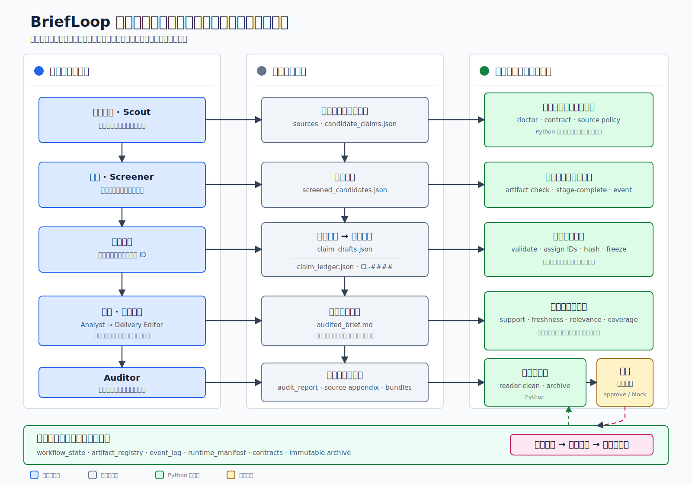

# BriefLoop：面向可审计商业简报的开源闭环工程

## 架构参考 v0.4.0：迈向 v1.0 的产品基线

**代码快照**：v0.11.12（tag `65b384c06bccffbb183a76db1260def02853b951`）
**分支**：`main`
**报告日期**：2026-07-10

> **版本边界。** 本报告描述不可变 tag `v0.11.12`（`65b384c06bccffbb183a76db1260def02853b951`）的实现状态。v0.6.x 至 v0.8.3 建立了运行时状态、声明冻结、阶段门禁、改进账本和不可变归档等可追溯骨干；v0.9.x 以实验性方式加入原子声明图、证据片段注册表、声明—证据支持矩阵和语义评估提案；v0.10.x 至 v0.11.x 增加报告类型、模板、政策配置、质量面板和交付包等产品层能力。是否稳定支持，以 `docs/architecture-status.md` 和 `docs/support-matrix.md` 为准。v0.11.12 快照中尚无合格的首用户证据记录；后续增加的 `docs/v1-pilot-evidence.md` 只是快照后的跟踪入口。接近 1.0 不等于已经证明输出质量或管理可用性。

## 摘要

BriefLoop 是一套面向周期性企业简报的开源闭环工程系统。它不把 AI 辅助报告视为一次性生成的文档，而把它视为受治理的发布工件：其中的声明、证据、失败、修复和交付决定都应当可以检查、追溯和复核。

v0.11.12 已形成可追溯骨干，并交付 v0.11.0 产品基线：`industry-weekly`、`management-monthly` 和 `document-review` 三类工作空间入口；`new`、`run`、`status`、`feedback`、`deliver` 五步写作路径；Hermes 委派式运行时；与具体运行宿主无关的操作员交接方式；以及 25 个可公开复现的评测用例和 2767 项以上的确定性测试，持续集成过程中不调用大语言模型。声明草稿由 Python 控制面冻结为权威声明账本；运行时状态、工件注册表、事件日志、阶段门禁、不可变归档、受众快照、改进记忆快照、溯源投影和人工触发交付共同构成问责骨架。

从 v0.9 开始，BriefLoop 以实验性控制面的形式推进“支持充分性”：原子声明图、证据片段注册表、声明—证据支持矩阵、只产生提案的语义评估报告、人工裁决记录、持久来源证据包，以及 UTF-8 文本的证据片段种子。这些能力可以记录结构、引用关系和人工裁决过的提案，但不能自动证明语义真伪，不能自行写入支持结论，也不能授权发布。

v0.10 至 v0.11 的产品层在上述骨干之上增加 `report_spec.yaml`、报告包、报告模板、政策配置、质量面板、质量摘要、静态 HTML 审计附件、模板符合性诊断、支持强度措辞诊断，以及读者交付包和审计包。这些能力负责工作空间配置、只读投影和渲染纪律，不构成第二套门禁系统，也不提供语义证明。

v1.0.0 的目标是冻结产品承诺并取得首用户证据，而不是继续扩张实验面。v0.11.12 快照中尚无合格的首用户证据记录；快照后增加的跟踪文件目前仍记录 `not_satisfied`。BriefLoop-090 及其冻结的历史实验标识 `MABW-080` 仅用于归档测量和实验复现，不属于普通用户的使用路径。

> **本版修订。** v0.4.0 将实现基线从 v0.8.3 同步到不可变 v0.11.12 tag，补入支持充分性实验栈、产品层、参考运行和快照后的首用户证据跟踪入口，并纳入 Weng（2026）对 Harness Engineering 研究的后验综述。Weng 的文章用于建立领域坐标，不作为 BriefLoop 输出质量或自我改进能力的实验依据；涉及机制和性能的数据仍以 LIFE-HARNESS、Self-Harness 等原始论文为准。

> **名称约定。** BriefLoop 是本项目唯一的现行名称。旧命令、schema、归档文件名和实验 ID 中可能仍含历史字面量，这些字面量只为兼容和复现而保留，不构成项目别名。详细规则见 `docs/briefloop-naming.md`。

## 1. 核心洞察

### 1.1 架构宪章

以下原则来自真实运行中的失败，不是宣传口号。

1. **聪明的无权，有权的确定，生效的过人，过人的留痕。** 大语言模型和智能体可以理解、建议、拆解和起草，但不能直接写入权威状态、推进阶段、冻结证据、通过门禁或批准交付。真正生效的变更必须由确定性控制面执行，并经过人工确认、留下记录。
2. **机器能管的，不交给记忆。** 能通过 schema、验证器、门禁、事务、事件或测试检查的规则，不能只停留在提示词或交接说明中。
3. **同一个字段只许有一个写者。** Python 写状态、账本、事件、哈希、门禁和归档；大语言模型写内容草稿；人类批准偏好和交付决定。派生投影不能反向覆盖权威记录。
4. **有来源，不等于被支持；能追溯，不等于被证明。** 检索计划、候选来源、搜索摘要和模型摘要只能用于发现。来源是否真正支持声明，必须按支持强度、来源层级、适用范围和时效性分别记录。
5. **冻结工件不能静默改写，缺口不能被隐藏。** 合法变化必须产生新修订、新工件、新事件或明确的取代、撤销、污染记录。失败门禁、缺失证据、被拒声明和人工决策缺口都必须留下可查询记录。
6. **冲突按预先声明的层级解决，而不是交给模型临场说服。** 事实契约和确定性门禁高于风格偏好；当前运行的修复高于跨运行的品味记忆；目标、读者、时间窗、来源政策和交付标准发生变化时，必须形成明确配置或新运行。
7. **跨模块不变量必须在结构上闭合。** 一个控制规则若跨越事务、状态重算、注册表、门禁、投影和运行时适配器，就必须有唯一权威记录，并覆盖所有写者、重算者和读取者；不能依赖每条路径分别“记得”保留同一事实。

### 1.2 运营纪律

- **产品骨架：加速不能偷走问责。** 可以复用冻结证据、减少重复推理、并行无依赖任务，但不能删减账本、门禁、批准、事件、快照和归档。
- **公开声明：不说工件证明不了的话。** 未测量的能力应明确写成“尚未测量”；只有可追溯性时，就不能宣称语义证明或质量提升。
- **数据边界：私有事实不能替公共机制背书。** 真实业务流程可以提供失败类型和测试形态，但私有业务事实、客户材料、雇主数据和未公开信息不能进入公开仓库、测试样例或演示。

### 1.3 为什么编程智能体进步得更快

编程智能体的进步不仅来自模型能力，也来自软件工程已经建立的闭合反馈回路：

| 软件工程机制 | 提供的改进信号 |
|---|---|
| 测试套件 | 明确的通过或失败结果 |
| Git 历史 | 每次变更的作者、原因和差异 |
| 缺陷到提交的追溯 | 可以定位是哪次变更引入问题 |
| 持续集成 | 合入前自动验证 |
| 代码评审 | 重要变更经过人工批准 |

模型提供能力，基础设施提供可重复的反馈信号。企业简报通常缺少这些条件：质量问题很难转化为明确测试，过时数据难以定位到具体检索环节，口头反馈不会积累，“这一段感觉不对”也很少成为可复用的工程任务。因此，业务工作流往往只能依靠个人经验缓慢改进，而且经验难以传递。

### 1.4 BriefLoop 的核心论点

BriefLoop 的目标不是让某个模型本身更聪明，而是把软件工程中的问责基础设施移植到企业简报：

| 软件工程机制 | BriefLoop 中的对应机制 |
|---|---|
| 测试套件 | 工件验证和阶段质量门禁 |
| Git 历史 | `event_log.jsonl` 中的决定、时间、操作者和原因 |
| 缺陷追溯 | `artifact_registry.json` 中的生产阶段、角色和工件关系 |
| 持续集成 | Orchestrator 控制循环和阶段完成事务 |
| 代码评审 | `request_human_review`、修复计划、人工裁决和改进账本 |

v0.7.1 的参考运行暴露了一个决定性问题：智能体完成了内容流水线，却几乎完全跳过控制流水线。它生成了八个内容工件，但没有调用决定事务，没有运行门禁，`workflow_state.json` 仍停留在初始阶段。智能体事后承认，它把 Orchestrator 合约当成背景说明，而不是必须执行的 API。

这次失败推动 BriefLoop 将关键记账从提示词迁移到事务。智能体仍负责提出“做什么、为什么”；Python 控制面负责确认“该决定是否已经合法生效、依赖哪些工件、满足哪些条件”。重要规则不能只写在说明中，必须落到 schema、验证器、门禁、事务、事件或测试里。

### 1.5 与 Harness Engineering 的独立收敛

2026 年 5 月至 7 月，两项实证研究和一篇研究综述从不同方向给出了与 BriefLoop 一致的外部坐标。

- **LIFE-HARNESS（Xu et al., 2026）**从训练轨迹中演化结构化运行 Harness，并将其应用于冻结模型。在 18 个模型骨干和 126 个模型—环境组合中，116 个组合获得改善，平均相对提升为 88.5%。它的四层结构按智能体生命周期中的拦截位置组织；BriefLoop 的四类合约按治理内容组织。两者是不同维度的分解，不能强行一一对应。
- **Self-Harness（Zhang et al., 2026）**采用“挖掘失败—提出有界修改—回归验证—接受或拒绝”的循环，并在 Terminal-Bench 的确定性奖励环境中提高三个模型族的留出测试通过率。该结果支持 Harness 可以成为独立优化对象，但不能直接证明开放域简报的内容质量会提高。
- **Weng（2026）**将 Harness 定义为围绕基础模型、负责编排执行、规划、工具调用、上下文管理、工件存储和结果评估的系统，并把研究演进概括为“提示词—结构化上下文—工作流—Harness 代码—优化器代码”。这是一篇研究综述与技术文章，不是针对 BriefLoop 的同行评审评测。[原文](https://lilianweng.github.io/posts/2026-07-04-harness/)

时间顺序也应准确记录：BriefLoop 的人工门禁改进账本和运行快照已进入 v0.7.0（2026-06-10），Python 持有的声明冻结事务已进入 v0.8.3（2026-06-16），均早于 Weng 的综述。因而，更准确的表述是**后验独立收敛**：Weng 提供了统一的研究语言和风险边界；BriefLoop 的仓库历史展示了这些原则在开放域企业简报中的一个早期工程实例。时间先后不能替代效果评测，也不构成优先权或性能优势证明。

### 1.6 从智能体工程到闭环工程

Loop Engineering 关注的不是如何写一次更好的提示，而是如何设计一个持续发现任务、分派任务、检查结果、记录状态并决定下一步的系统。BriefLoop 将这一方法用于周期性企业简报：控制单元不再是代码差异，而是重要声明、证据片段、支持记录、`FeedbackIssue`、修复任务和交付决定。

| 闭环工程要素 | 编程场景 | BriefLoop 场景 |
|---|---|---|
| 定时发现 | 定期扫描问题 | 周报、月报和周期性研究任务 |
| 隔离工作区 | Git worktree | 独立运行工作空间 |
| 技能 | 项目级 `SKILL.md` | 受众画像、政策配置和角色契约 |
| 连接器 | issue tracker、数据库、API | 来源提供器和交付连接器 |
| 子智能体 | 制作者与检查者分离 | 起草者与审计者分离 |
| 持久记忆 | 磁盘文件和提交历史 | 改进账本、声明账本和事件日志 |
| 验证 | 单元测试和回归测试 | 质量门禁和同证据回归 |
| 人工复核 | Pull Request 评审 | 人工裁决和交付批准 |

## 2. 设计哲学

### 2.1 三层质量体系

BriefLoop 将质量区分为三个层次，避免把“流程合规”“交付干净”和“分析优秀”混为一谈。

1. **规则层（Law）**：机器可以检查的要求，例如引用是否存在、来源是否过期、数字是否与账本一致、读者版是否泄露内部标识。该层可以由哈希、事件和门禁报告验证，但只能捕获可形式化的错误。
2. **诚实交付层（Honesty）**：读者交付物是否干净、可读、没有内部流程残留或空白引用。它衡量交付纪律，不衡量分析深度。
3. **分析判断层（Wisdom）**：简报是否抓住真正重要的问题，分析是否有洞察、是否优于单模型基线。当前状态仍是**尚未测量**。不同运行之间的声明层工件不完全相同，因果归因尚不成立。

正确顺序是先稳定规则层，再稳定诚实交付层，最后在受控基线上测量分析判断。交付本身尚未稳定时，内容质量比较会受到过多混杂因素影响。

### 2.2 正确性、品味与证据

| 维度 | 关注内容 | 治理机制 | 权威写者 |
|---|---|---|---|
| 正确性 | 事实错误、过时数据、归因错配、结构违规 | schema、阶段验证和确定性门禁 | Python 控制面 |
| 品味 | 部门偏好、文化规范、未明说的读者期望 | 受众画像和人工批准的改进账本 | 人类；模型负责解释和应用 |
| 证据 | 来源与声明的绑定、支持强度、时效性和权威层级 | 声明草稿、冻结账本、证据片段和来源附录 | 模型起草；Python 冻结和验证 |

正确性可以部分机械化；品味必须保持可由人类编辑；证据位于两者之间。模型可以发现和起草声明，但声明 ID、冻结记录、哈希和支持元数据必须由确定性控制面持有。

### 2.3 治理域与控制面

四类合约回答“治理什么”：

| 合约类别 | 治理范围 |
|---|---|
| 行为合约（Behavior） | Orchestrator 与专家角色的权限边界 |
| 过程与工件合约（Process / Artifact） | 阶段就绪条件和预期工件 |
| 事实与证据合约（Fact-Grounding / Evidence） | 重要声明能否追溯到被登记的证据 |
| 质量与受众合约（Quality / Audience） | 交付物是否符合读者和质量要求 |

控制面回答“谁写、何时冻结、如何验证、失败时发生什么”。因此，合约类别与控制面不是两套竞争架构：前者描述治理内容，后者把治理内容落实为文件、写者、事务和失败状态。完整清单见 `docs/control-surfaces.md`。

### 2.4 单一写者原则

- Python 写控制状态、账本、事件、哈希、门禁、事务和归档；
- 运行时智能体写候选声明、筛选结果、声明草稿、简报正文和语义审计意见；
- 人类写批准、受众指导、交付决定和明确的运行方向。

`claim_drafts.json` 与 `claim_ledger.json` 被设计为两个工件，正是为了落实这一原则：模型只能写不带权威 ID 的草稿；Python 负责分配稳定 ID 并冻结账本。任何一方都不能顺手改写对方持有的工件。

### 2.5 速度原则

速度只能来自复用冻结工件、减少重复推理和并行无依赖任务，不能来自少记录、少门禁、少批准或弱化归档。快速重跑会导入并校验既有事实层，从分析阶段重新开始；它仍保留写作、审计、门禁、最终化和人工交付路径。加速来自复用，而不是省略。

## 3. 架构：五条控制骨干



*图 1：智能体负责内容工作，确定性控制面负责状态、冻结、门禁和归档；人工负责关键授权与最终交付。*

### 3.1 运行时状态骨干

```text
runtime_manifest.json
→ workflow_state.json
→ artifact_registry.json
→ event_log.jsonl
```

Python 控制面是唯一写者。每次运行都会在 `output/intermediate/` 中形成完整的状态记录。运行完整性模块会区分干净、受污染和已记录修复等状态；重置运行、在过时状态上重放阶段或修改冻结工件时，系统必须写入污染事件。计时信息只从事件日志投影，不伪造精确的模型运行时长。

### 3.2 证据与声明骨干

```text
来源证据
→ 持久来源证据
→ 输入分类
→ candidate_claims.json
→ screened_candidates.json
→ claim_drafts.json
→ 冻结事务
→ claim_ledger.json
→ audited_brief.md
→ audit_report.json
→ source_appendix.md
```

运行时智能体负责候选、筛选、声明草稿和简报内容；Python 在 `claim_drafts.json` 到 `claim_ledger.json` 的边界进行验证和冻结。

声明冻结事务的步骤如下：

1. 声明角色写入不含 `claim_id` 的 `claim_drafts.json`；任何层级预先携带 `claim_id` 都会被拒绝。
2. `briefloop state freeze-claim-ledger` 读取已验证草稿，按确定性顺序分配 `CL-####`，写入权威 `claim_ledger.json`，记录哈希和冻结元数据，并追加 `claim_ledger_frozen` 事件。
3. `briefloop state stage-complete --stage claim-ledger` 要求存在相匹配的冻结记录；哈希漂移、冻结元数据缺失或账本字节过期都会失败关闭。
4. 分析和审计角色只能读取冻结后的账本，不得读取草稿作为权威输入，也不得修改账本。

### 3.3 门禁骨干

```text
CompositeAuditAgent
├── DeterministicAuditAgent
├── QualityHarnessAuditAgent
└── NoOpSemanticAuditAgent
    → gates/auditor_quality_gate_report.json
    → gates/finalize_quality_gate_report.json
```

前两类审计均由 Python 执行，不调用大语言模型。语义审计槽当前仍是占位；运行时审计角色需要检查支持强度是否与措辞匹配，但项目尚未交付具有发布权威的模型语义审计器。审计阶段和最终化阶段各自读取阶段范围的门禁报告；旧版 `quality_gate_report.json` 只是兼容投影，不是冻结权威。

### 3.4 记忆与改进骨干

```text
audience_profile.md
→ audience_profile_snapshot.md

improvement/ledger.jsonl
→ improvement/memory.md
→ improvement_memory_snapshot.md
```

人类维护受众画像并批准改进指导；Python 负责从账本生成记忆、冻结每次运行的快照，并在运行清单中记录生效条目及 SHA-256。运行中发生的批准或撤销只影响后续运行，不能改变当前运行已经冻结的输入。每个账本修订通过前序哈希形成链式记录。

### 3.5 交付与归档骨干

```text
output/delivery/brief.md
output/delivery/<name>.docx
output/source_appendix.md
output/runs/<run_id>/
output/intermediate/finalize_report.json
```

Python 最终化事务从已审计正文生成读者交付物，处理内部引用标记，附加读者可见来源说明，并渲染 DOCX。`output/source_appendix.md` 是审计和控制副本。每次完成的运行都会归档交付物、中间工件、控制记录和哈希清单；新的 `output/` 可以前进，但不能覆盖历史运行。

### 3.6 产品层与支持充分性实验栈

```text
report_spec.yaml
→ ReportPack / ReportTemplate / PolicyProfile
→ atomic_claim_graph.json
→ evidence_span_registry.json
→ claim_support_matrix.json
→ semantic_assessment_report.json
→ semantic_support_acceptance_ledger.json
→ quality_panel.json / quality_summary.md / quality_panel.html
→ delivery_bundle.zip / audit_bundle.zip
```

该栈的权威边界如下：

- 专家角色可以起草原子声明图、证据片段、支持矩阵行和语义评估提案；
- Python 只验证 schema、引用关系、哈希绑定、必要行覆盖和裁决记录格式；
- `semantic-support adjudicate` 记录人工接受或拒绝，但裁决记录不会自动改写支持矩阵；
- `briefloop new`、`packs bundle`、`quality summarize`、`extract` 和 `sources materialize-pack` 只写工作空间结构或投影，不运行专家角色、不批准交付，也不证明语义正确性。

稳定支持的产品入口为：

| 用户命令 | 内部报告包 | 用途 |
|---|---|---|
| `briefloop new industry-weekly` | `market_weekly` | 行业周报 |
| `briefloop new management-monthly` | `management_monthly` | 管理层月报 |
| `briefloop new document-review` | `evidence_extract` | 文档证据提取工作空间 |

## 4. 控制事务

### 4.1 阶段完成事务

`stage-complete` 和 `finalize-complete` 把阶段记账从提示词义务迁移到确定性执行。事务会：

- 检查预期工件是否已在 `artifact_registry.json` 中登记且有效；
- 更新 `workflow_state.json` 的阶段状态；
- 向 `event_log.jsonl` 追加完成事件；
- 执行阶段特定前置条件，例如声明账本阶段必须存在匹配的冻结记录。

Orchestrator 决定行动及其理由；Python 记录该决定是否已经在满足条件的情况下合法生效。

### 4.2 声明账本冻结事务

| 操作 | 权威写者 | 工件或结果 |
|---|---|---|
| 起草声明 | 声明角色 | `claim_drafts.json`，不含 `claim_id` |
| 验证草稿 | Python | 拒绝预先写入的 ID 和无效结构 |
| 分配 ID | Python | 稳定的 `CL-####` |
| 冻结账本 | Python | `claim_ledger.json`、冻结元数据和事件 |
| 完成阶段 | Python | 无匹配冻结记录则拒绝完成 |

冻结完成后，分析和审计角色只能读取账本。任何修改都必须形成新运行或明确的污染、取代和修复记录。

### 4.3 运行完整性与污染

`workflow_state.json.run_integrity` 记录运行是否仍可作为干净参考证据。重置已执行运行、在过时状态上重放阶段或修改冻结工件时，系统会写入 `run_integrity_contaminated` 事件及原因。受污染运行可以继续形成受约束的交付，但不能冒充 A 级受控实验。

### 4.4 不可变归档

归档目录 `output/runs/<run_id>/` 保存：

- Markdown、DOCX 等交付工件；
- 声明账本、门禁报告和审计报告等中间工件；
- 运行状态、事件日志和运行清单等控制记录；
- 所有纳入清单的 SHA-256。

归档只能追加，不能原地改写。

### 4.5 快速重跑导入

`briefloop state import-fact-layer` 可以把已归档的来源证据、输入分类、候选声明、筛选结果和声明账本复制到新工作空间。事务复制原始字节、验证哈希、记录导入关系，并将已满足的上游阶段标记为“由导入完成”。`briefloop run --recipe fast-rerun` 从分析阶段开始；最终化时仍会按照新工作空间的时间重新检查来源时效性。快速重跑复用的是事实层，不复用旧简报、审计结果、最终化记录或交付批准。

## 5. 证据与声明治理

### 5.1 从来源到声明

```text
来源发现
→ 持久来源证据
→ 输入分类
→ 候选声明
→ 筛选结果
→ 声明草稿
→ 确定性冻结
→ 声明账本
```

只有已经物化的来源文件和受支持的来源配置条目才能成为证据。`source_candidates.yaml` 只用于规划和评审，不能代替 `sources.yaml`，也不能据此宣称来源发现已经完成。检索计划、搜索摘要和模型摘要都是发现材料，不是证据本身。

当前来源记录要求至少包含来源 ID、名称、类型、标题和内容。证据片段、抓取时间、来源层级和摘录哈希属于支持充分性方向；它们可以增强追溯，但仍不能自动证明来源在语义上支持声明。

### 5.2 声明草稿合约

`claim_drafts.json` 是声明冻结事务的输入。任何草稿条目或其元数据都不得预先包含 `claim_id`。冻结算法 `sorted_sequential_v1` 会按照稳定键排序并分配 `CL-####`；相同冻结输入产生相同 ID，但如果草稿集合本身发生增删或重排，则不承诺跨冻结保持原 ID。

这一设计避免模型伪造权威身份：模型负责声明内容，系统负责声明身份和冻结状态。

### 5.3 支持强度校准

v0.7.4 的失败研究暴露出五类常见问题：

1. **支持强度膨胀**：来源只表明存在某种监管讨论，正文却写成正式认可；
2. **来源权威膨胀**：会议消息或媒体报道被写成政府计划或官方事实；
3. **声明混同**：得到支持的主事实与未经验证的子结论写在同一句话中；
4. **归因错配**：一个来源被用来承载多个并未逐一得到支持的结论；
5. **预测被误当成证据**：二级市场预测或评论被作为核心事实依据。

这些问题不是“没有来源”，而是来源与措辞之间的校准失败。审计角色需要检查夸大表述、支持强度、置信度、证据关系和限制条件。实验性支持记录可以使用 `explicitly_supported`、`partially_supported`、`supportive_but_overextended`、`attribution_mismatch`、`needs_primary_source`、`unsupported` 等标签，但标签本身仍需要人工裁决，不能直接成为发布权威。

### 5.4 来源附录的边界

`output/source_appendix.md` 在最终化过程中根据读者正文实际引用的声明生成，并被嵌入 Markdown 和 DOCX 交付物，同时保留一份审计副本。来源附录为读者提供追问入口，但不是事实正确证书。它证明的是“可以追到哪里”，不是“已经证明为真”。

## 6. 门禁与修复

### 6.1 阶段范围门禁

| 门禁报告 | 约束阶段 | 主要检查内容 |
|---|---|---|
| `gates/auditor_quality_gate_report.json` | 审计阶段完成 | 重要事实、时效性、目标相关性、覆盖遗漏 |
| `gates/finalize_quality_gate_report.json` | 最终化完成 | 读者版残留、内部 ID、流程用语和交付卫生 |

阶段范围报告是权威记录。旧的 `quality_gate_report.json` 只保留为兼容投影。完成事务没有绕过门禁的 `--force` 路径。

### 6.2 确定性审计栈

```text
运行时审计角色
→ CompositeAuditAgent
→ DeterministicAuditAgent
→ QualityHarnessAuditAgent
→ NoOpSemanticAuditAgent
→ audit_report.json
```

确定性审计负责来源、时效性、数字、日期、安全措辞、流程残留和脱敏检查；质量 Harness 审计负责重要事实、目标相关性和读者残留等规则。语义审计槽仍是占位符。未来即使加入模型语义评估，也不能覆盖确定性发现，不能单独决定支持真相或交付资格。

### 6.3 修复路由

`briefloop repair route` 是只读诊断命令。它把门禁、审计、注册表和工作流发现映射到应负责的阶段及允许修改的工件类别。它告诉 Orchestrator“修复应当由谁处理、可以改哪里”，但不创建正文、不执行修复，也不替代修复计划。

### 6.4 反古德哈特原则

《Precision Is Not Faithfulness》说明，只优化精度可能鼓励系统删掉难以验证但重要的内容。对 BriefLoop 而言，每个阻塞型精度门禁在上线前都必须回答一个问题：**系统最便宜的过关方式是什么？** 如果最便宜的策略是删内容，就必须同时设置覆盖或遗漏检查，防止通过沉默获得高分。

### 6.5 覆盖与遗漏连续性

当前稳定门禁会检查 `screened_candidates.json` 中的高优先级候选，是否在声明账本或被引用的简报中无声消失。它捕获的是“已经筛选通过，却在分析或编辑阶段被遗漏”的路径，不等于对所有相关事实具有完整召回，也不证明全文覆盖充分。

## 7. 受控记忆与改进

### 7.1 受众画像

`audience_profile.md` 是工作空间中的人工可编辑文件，用于记录结构偏好、部门词汇、语气和长期反馈。每次运行只读取冻结的 `audience_profile_snapshot.md`。运行过程中修改实时画像，只能影响后续运行。画像属于语义指导，不是证据，也不具有门禁权威。

### 7.2 改进账本

`improvement/ledger.jsonl` 是追加写入、带修订链、需要人工批准的工作空间账本。其生命周期为：

```text
提出 propose
→ 人工批准 approve
→ Python 重建 improvement/memory.md
→ 下一次运行冻结 improvement_memory_snapshot.md
→ 必要时撤销 revert
```

关键不变量包括：

- 提出条目不会影响任何运行；
- 批准只追加状态，不改变当前运行；
- 物化发生在下一次运行开始时；
- 被撤销条目从下一次记忆和快照中移除；
- `runtime_manifest.json` 中的 `materialized_entry_ids` 和哈希，记录本次运行实际读取了哪些指导。

### 7.3 指导是否被体现

实验性 `guidance_manifestation_report.json` 可以记录已批准指导在输出中的可观察状态：明确体现、部分体现、相互矛盾或无法观察。Python 只验证标签并统计数量，不判断标签是否语义正确，不修改改进记忆，也不阻止最终化。

BriefLoop-090 的归档实验可以导入外部评估者给出的体现评分，但该测量不属于普通产品路径，也不能据此宣称输出质量已经提升。

### 7.4 尚未交付的记忆表面

| 计划工件 | 状态 | 作用 |
|---|---|---|
| `improvement/intake.jsonl` | 延期 | 接收带来源关系的原始反馈 |
| `improvement/candidates.jsonl` | 延期 | 暂存尚未批准的规则或偏好候选 |
| `reference_samples/manifest.jsonl` | 计划中 | 保存经人工接受的品味样例 |

这些能力在核心账本的“提出—批准—物化—冻结—撤销”生命周期稳定之后再引入。

### 7.5 受控 Harness 改进协议（提案）

v0.11.12 已具备事件轨迹、门禁发现、`FeedbackIssue`、`RepairPlan`、评测 fixture、改进账本和运行快照，但尚未形成端到端的 Harness 自我改进系统。未来协议必须保持以下权威边界：

| 阶段 | 允许行为 | 权威限制 |
|---|---|---|
| 观察薄弱点 | 从事件、门禁、审计和人工反馈形成结构化候选 | 观察不会自动变成修改 |
| 提出有界修改 | 智能体针对反复且可定位的问题提出窄修改，并声明可编辑范围和应保留行为 | 智能体不能写入活动 Harness |
| 回归验证 | 用域内案例确认目标问题已修复，用留出案例和同证据重跑检查副作用 | 评估器和权限控制位于可编辑循环之外 |
| 授权 | 人工接受或拒绝，确定性事务记录输入、版本、结果和决定 | 只有批准事务能生成候选新版本 |
| 生效 | 新版本仅影响未来运行；被拒方案和负面结果继续留痕 | 不回写当前运行或历史冻结运行 |

因此，BriefLoop 所谓“改进”不是让智能体直接改写自身控制面，而是把生产失败转化为可定位、可提案、可回归、可批准和可撤销的工程变更。企业简报中的重要性、分析品味和管理价值仍需要人类判断；确定性门禁只能提供局部、可审计的弱奖励面。

## 8. v0.11.12 实现基线

### 8.1 版本演进

| 版本 | 主题 | 核心能力边界 |
|---|---|---|
| v0.8.3 | 声明冻结事务 | 草稿声明由 Python 分配稳定 ID 并冻结 |
| v0.9.0—v0.9.3 | 支持充分性实验核心 | 原子声明图、证据片段注册表、声明—证据支持矩阵 |
| v0.9.4 | 语义评估提案 | 语义评估报告、输入绑定和人工裁决记录；不写支持真相 |
| v0.10.x | 产品层与交付硬化 | 报告配置、交付包投影、最终化事务和五步写作路径 |
| v0.11.0 | 产品基线 | 三类 `briefloop new` 入口、政策配置、模板和措辞诊断 |
| v0.11.12 | 运行时与操作面 | operator 运行时、人工语义裁决和 source-clone WorkBuddy Skill bundle |
| v1.0.0（目标） | 产品冻结 | 冻结承诺并满足首用户证据门禁，不以扩张能力为目标 |

### 8.2 稳定支持

- 默认和严格两类专家角色拓扑，以及 Delivery Editor；
- Hermes、Claude Code、OpenCode 和 operator 运行时；
- 运行状态、工件注册、事件日志、声明冻结、阶段完成事务、最终化事务、污染记录和不可变归档；
- 审计阶段与最终化阶段门禁，以及覆盖和遗漏连续性检查；
- 确定性审计、修复路由、反馈与修复计划命令、Orchestrator 控制总开关；
- 改进账本、受众快照、每运行改进快照和溯源投影；
- `output/delivery/` 读者交付包、来源附录审计副本和事务化交付提升；
- 输入治理四分类，以及市场竞争、政策和监管分析模块；
- 25 个公开安全评测用例和 2767 项以上确定性测试；
- `industry-weekly`、`management-monthly`、`document-review` 三类产品入口。

### 8.3 实验性能力

- 原子声明图、证据片段注册表、声明—证据支持矩阵、语义评估与人工裁决；
- 报告模板渲染、政策配置门禁适配、质量面板、重要性和支持措辞诊断；
- UTF-8 文本证据片段种子、持久来源证据包和 SourceHub Lite 设置；
- 快速重跑事实层导入；
- MinerU 输入提取、Codex、source-clone WorkBuddy Skill bundle、飞书和 PDF 等实验路径；
- BriefLoop-090 及其冻结历史 ID `MABW-080` 的归档实验工具。

### 8.4 尚未交付

- 端到端问题候选系统；
- 具有发布阻断权的完整覆盖门禁；
- 以语义回归为发布权威的 Harness；
- 发布资格总表；
- 大语言模型散文打分、私有商业 benchmark 和自主学习；
- 改进反馈接收与候选提升流水线；
- 经真实制品验证的 `pipx install briefloop` 主安装路径。

### 8.5 v1.0 证据门禁

`docs/control-surfaces.md` 中的冻结清单标识了可获得向后兼容承诺的表面。v1.0 还要求至少一条可公开复现的首用户证据，例如外部 fresh-clone、WorkBuddy 首用、pilot checklist 或周期性周报 dogfood。v0.11.12 快照中尚无这类记录；后续增加的 `docs/v1-pilot-evidence.md` 是快照后的跟踪入口，目前仍记录 `not_satisfied`。

BriefLoop-090 已完成一个合成 `auditable_brief` 试点，可以支持“在单一案例中观察到指导模式差异”这一窄口径陈述，不能支持泛化的输出质量、管理就绪或交付质量声明。

## 9. 参考证据与失败研究

### 9.1 v0.7.2 公开太阳能集成运行

两轮公开材料运行证明了以下机制能够闭合：

- 已批准指导可以物化为每次运行冻结的改进记忆；
- 质量门禁曾三次主动阻止阶段推进，并在修复后通过；
- Orchestrator 能读取冻结快照，而不是实时可变的工作空间记忆；
- `runtime_manifest.json` 记录了生效条目 ID 和相应哈希。

这次运行不能证明输出质量提高，也不能证明指导产生了因果效果。两轮运行的候选声明、筛选结果和声明账本哈希并不相同，因此指导不是唯一变量。该运行适合作为 B+ 级集成证据，不是 A 级受控实验。

### 9.2 v0.7.4 失败研究

一次产业研究运行生成了完整、可读的简报，也保留了全套流程工件；外部评审仍发现支持强度膨胀、权威层级错配、声明混同、归因错配和预测被误当作事实等问题。

它没有证明 BriefLoop 输出更好，却证明了一个更窄也更重要的能力：在直接模型起草中，错误往往只留在最终文本里；在 BriefLoop 中，错误可以沿“来源摘要—候选声明—筛选结果—声明账本—已审计正文—读者交付物”回溯。失败没有被自动修好，但传播路径被保存下来。

### 9.3 内容与控制解耦

v0.7.1 的运行说明，模型能够完成所有内容工作，同时跳过几乎全部控制义务。该失败直接促成阶段完成、最终化完成和声明冻结事务。它支持的结论是：**提示词义务不等于执行保证。** 如果规则重要，就必须存在可由机器验证的执行路径。

### 9.4 证据边界

| 证据 | 可以支持的结论 | 不能支持的结论 |
|---|---|---|
| 太阳能 B+ 运行 | 门禁真实执行；改进记忆链路闭合 | 输出质量提高；指导具有因果效果 |
| 失败研究 | 错误传播路径被保留；失败可分类 | BriefLoop 优于单模型基线 |
| 内容与控制解耦 | 模型不适合承担低层权威记账 | 所有模型都会以相同方式失败 |
| BriefLoop-090 | 同一冻结事实层下可观察到指导模式差异 | 泛化质量、管理就绪或 DOCX 质量 |

### 9.5 合成试点与产品层参考包

BriefLoop-090 使用单一公开安全的合成案例，对基线组（`baseline`）、记忆组（`memory`）和仅提示组（`prompt-only`）三种条件进行盲评和哈希绑定导入。观察结果符合预期：基线组未体现目标指导，记忆组较稳定，仅提示组出现过度应用。该结果仅适用于一个案例。

v0.11.3 产品层参考包展示了确定性 `same_evidence_reader_quality_regression`：读者版不含内部声明标记，审计包保留追踪记录，质量面板汇总重要性、模板、措辞和轨迹诊断。该参考包不调用模型，因此也不能证明模型输出质量或交付批准。

## 10. 相关研究与产业实践

### 10.1 Harness 适配与优化

LIFE-HARNESS 和 Self-Harness 共同表明，模型与环境之间的接口层可以成为独立优化对象。前者在清晰的二元奖励环境中演化运行时干预，后者使用失败挖掘、有界提案和域内/留出回归。BriefLoop 面对的是开放域简报：奖励信号稀疏、主观且经常只存在于人的经验中。因此，BriefLoop 不能直接复制自动演化，而需要结构化人工反馈、外置评估器、权限边界和冻结后的跨运行比较。

Weng（2026）的综述把 Harness 扩展为工作流、上下文生命周期、持久状态、工具、子智能体、权限和评估组成的运行系统。她同时强调：递归结构本身不足以保证改进；模糊评估、奖励投机和长期维护目标仍未解决；评估器和权限控制应位于可编辑循环之外；人在关键决策点上应当“上移”，而不是被移除。

BriefLoop 已稳定实现轨迹调控的一部分：当重试、修复循环或重复阻塞超过预算时，Python 将当前阶段的合法决定收窄为 `request_human_review` 和 `block_run`，并写入事件日志。这是控制状态收窄，不是自动修复。

### 10.2 多轮反馈与回归

DRA Multi-Turn 的研究发现，模型自我反思的净收益很小，流程级反馈可以带来明显的单轮改善，但后续改写会使先前已经满足的条件发生回归。该结果支持 BriefLoop 的定向修复、冻结快照和外部门禁，也解释了为什么同证据回归不能只检查“这次问题是否消失”，还要检查“此前通过的行为是否仍被保留”。

### 10.3 可审计的人机协作

CHAP 使用工作空间、任务、工件和追加式证据日志描述多人—多智能体协作。它关注通信协议；BriefLoop 关注企业简报内部的治理和发布责任。两者都强调，协作结果必须落在可检查工件上，而不是只存在于短暂对话中。

### 10.4 评估方法

《Precision Is Not Faithfulness》提醒，单一精度指标可能奖励“少说少错”。ResearchLoop 则强调，证据门禁不能由被评估的模型自己执行。BriefLoop 的回应是把冻结、哈希、覆盖检查、阶段状态和交付卫生留在非模型控制面，同时把语义判断保留为提案或人工裁决输入。

### 10.5 多智能体框架

AutoGen、CAMEL、MetaGPT 等系统主要研究模型之间如何通信和分工。BriefLoop 的差异不在于智能体数量，而在于合约、文件状态、阶段事务和权威写者。多智能体只有在上下文隔离、可并行探索或明确专业分工时才值得使用；否则协调成本、维护成本和故障点可能超过收益。

### 10.6 记忆与偏好

BriefLoop 的受众画像借鉴了工作空间级用户文件的形式，但增加了工作空间本地账本、人工批准、每次运行冻结、链式哈希和生效条目清单。实时记忆不能静默改变当前运行，偏好不能覆盖事实门禁，投影不能回写源账本。

### 10.7 企业知识工作智能体

本节使用 Anthropic 和 OpenAI 的官方文章与案例作为产业实践证据，而不是同行评审证明。它们支持的是行业正在从对话式问答转向可交付、可审计、可治理的知识工作流程；它们不证明 BriefLoop 的实现正确或质量更高。

#### 10.7.1 从对话到可交付成果

Claude Cowork 的产品资料把知识工作智能体定位为能够处理多来源、多步骤、跨应用任务并产出文档、表格、演示文稿和邮件的系统。周期性简报恰好属于这种任务：输入分散、输出需要交付、过程重复，而且用户通常知道什么样的结果才算合格。

#### 10.7.2 企业分析首先是上下文与验证问题

Anthropic 的内部分析实践把主要错误归纳为概念或实体歧义、数据过时和检索失败，并使用权威数据集、语义层、血缘图、固定离线评测集和消融实验控制这些问题。Kepler 的金融案例进一步把模型限制为流水线中的一个推理环节，由确定性基础设施承担验证和追溯。

这与 BriefLoop 的分工一致：模型起草和质疑；Python 冻结、验证、记录和执行门禁；证据片段和支持矩阵明确来源与声明之间的关系；同证据重跑用于观察修改是否引入回归。

#### 10.7.3 从提示词到运行支撑系统

大型代码库中的智能体实践表明，企业部署依赖项目约定、自动化钩子、技能、插件、工具连接、权限、所有权和评审流程，而不只是模型。BriefLoop 的合约、控制面、门禁、冻结工件、事件日志和人工批准，在简报场景中承担类似作用。

#### 10.7.4 多智能体的适用边界

多智能体系统在三种情况下最有价值：隔离会污染主上下文的子任务、并行探索较大搜索空间、为不同职责配置专门工具和上下文。除此之外，协调成本通常很高。BriefLoop 因此不以“更多智能体”为卖点；角色拓扑可以变化，但工件契约和控制责任保持不变。

#### 10.7.5 从质量治理到安全治理

智能体接入企业工具后，风险扩展到提示注入、工具投毒、身份和权限滥用、记忆污染及供应链攻击。身份、授权、撤销、沙箱和审计日志应当成为系统级能力。BriefLoop 的改进账本、人工批准、冻结快照、事件日志、交付门禁和连接器治理，既是质量控制，也是安全控制。

#### 10.7.6 生产追踪与受控改进

OpenAI Tax AI 案例将改进闭环分为三个支柱：专家从业者修正、从源材料到最终提交的生产追踪，以及把反复出现的问题转成有边界的评测和工程任务。并非每次人工修改都自动成为代码任务；提取遗漏、领域判断、产品边界和工作流噪声必须先被区分。

这与 BriefLoop 的目标一致：人工修改、审计发现、引用错配和支持不足，先形成结构化问题；只有反复、可定位、可测试的问题才进入修复队列。自我改进不是模型独自反思，而是生产系统把失败转成可验证、可批准的工程任务。

| Tax AI 实践 | BriefLoop 中的对应机制 |
|---|---|
| 源文件 | 来源包 |
| 字段提取 | 原子声明提取 |
| 字段引用 | 证据片段 |
| 专家修正 | 人工裁决和反馈问题 |
| 字段级复核行 | 支持记录和 `FeedbackIssue` |
| 重复修正模式 | 评测目标 |
| 有边界的代码修复 | 有范围限制的工作流修复 |
| 回归评测 | 语义回归和同证据重跑 |
| 已提交结果 | 经人工批准的简报交付物 |

## 11. 局限性与未来工作

### 11.1 已知边界

v0.11.12 不声称具备以下能力：

- 自动证明语义真伪；
- 已经提高简报内容质量；
- 自主执行修复；
- 在不同模型和运行时上稳定体现所有指导；
- 自动完成事实核查；
- 默认生成可直接发送给管理层的交付物；
- 已经交付端到端的自我改进 Harness。

当前更准确的能力边界是：重要声明可以连接到注册来源、工件和控制记录；可选支持记录和语义评估提案可以被观察和人工裁决；这些能力提供可追溯性和支持充分性记录，但不提供真理证明。

v0.11.12 尚未自动聚类由验证器确认的薄弱点，尚未交付 Harness 提案的批准事务，也没有证明修改后的 Harness 在留出简报案例上无回归。改进账本目前管理的是人工批准的读者指导，不授权智能体修改代码、合约、门禁、政策或未来运行读取的控制状态。

### 11.2 v1.0 的重点

v1.0 的工作重点应当是冻结承诺并取得首用户证据，而不是继续扩展实验面。产品层已经具备三类工作空间入口、报告配置、五步写作路径、状态投影、读者/审计交付包和质量面板。下一步需要证明一个新用户能在全新环境中完成可复现运行，并理解系统何时阻塞、为何阻塞、哪些工件具有权威。

### 11.3 支持充分性方向

已经存在的实验面包括原子声明图、证据片段注册表、声明—证据支持矩阵、语义评估提案、人工裁决、持久来源证据包和质量面板。仍待完成的路径为：

```text
阻塞式覆盖门禁
→ 域内/留出回归接受协议
→ 具有发布权威的回归 Harness
→ 发布资格总表
→ 问题候选系统
```

语义模型可以提出标签、说明不确定性和解释分歧，但不能直接决定支持真相、修复归属、归档等级、未来运行政策或发布资格。发布权威仍在 schema、哈希、政策、人工裁决和确定性阻断规则中。

### 11.4 从失败到改进

未来问题候选系统应遵循以下路径：

```text
报告失败
→ 声明级追踪
→ 结构化问题
→ 评测目标
→ 有范围限制的修复
→ 同证据回归
→ 人工复核
→ 更新发布资格
```

不是每次修正都应自动进入工程队列。进一步修改 Harness 时，还必须满足四个条件：预先声明可修改范围；评估器和权限控制位于可编辑循环之外；域内案例确认目标问题已解决，留出案例确认没有回归；批准版本只影响未来运行。

### 11.5 非目标

BriefLoop 不以一个全局语义分数作为发布权威，不让模型评审者决定最终支持真相，不让 Python 假装具备语义判断，也不会为了速度削弱账本、事件日志、归档、人工交付和冻结工件规则。

对外最准确的一句话是：

> BriefLoop 让企业简报中的声明、证据和交付决定进入可审计的工程闭环；它不证明真相，也不消除幻觉。

## 附录 A：合约类别

`configs/orchestrator_contract.yaml` 定义四类合约：

| 类别 | 中文说明 |
|---|---|
| `behavior` | 角色权限和行为边界 |
| `process_artifact` | 阶段顺序、就绪条件和工件预期 |
| `fact_grounding_evidence` | 声明与来源、证据和支持记录的关系 |
| `quality_audience` | 质量要求、读者要求和交付边界 |

## 附录 B：决定词汇表

Orchestrator 的合法决定包括：

| 决定 | 含义 |
|---|---|
| `continue` | 当前阶段满足条件，继续下一阶段 |
| `retry_stage` | 在同一阶段重新执行 |
| `delegate_repair` | 将有界修复交给相应角色 |
| `request_human_review` | 请求人工判断或批准 |
| `block_run` | 阻止运行继续 |
| `finalize` | 在审计和门禁满足后进入最终化 |

各阶段允许使用哪些决定，以 `configs/stage_specs.yaml` 为准。

## 附录 C：控制面索引

权威控制面分为四组：

- 运行状态：运行清单、工作流状态、工件注册表和事件日志；
- 证据与正确性：来源证据、声明账本、门禁报告、审计报告和支持记录；
- 品味与改进：受众画像、改进账本、冻结快照和体现诊断；
- 交付与归档：最终化报告、读者交付包、审计包和不可变运行归档。

字段级权威定义见 `docs/control-surfaces.md` 和 `src/multi_agent_brief/orchestrator/runtime_state/`。

## 附录 D：角色与阶段

```text
doctor（Python）
→ source-discovery
→ input-governance（Python）
→ scout
→ screener
→ claim-ledger
→ analyst
→ delivery-editor
→ auditor
→ finalize（Python）
```

默认拓扑允许 Scout 同时完成发现和筛选；严格拓扑使用独立 Screener；`human_assisted` 拓扑可以在指定节点引入人工参与。拓扑只改变角色分配，不改变工件契约和控制责任。

## 附录 E：评测框架

25 个打包评测用例验证确定性控制行为，而非模型文章质量。覆盖范围包括：

- 质量门禁和反馈分类；
- 运行时阻塞与轨迹预算耗尽；
- 溯源投影与持久来源证据；
- 改进账本物化和指导体现诊断；
- 发布准备记录的伪造检测；
- 读者版内部标记清理；
- Hermes 静态不变量；
- `same_evidence_reader_quality_regression` 产品层回归包。

历史实验命令使用冻结标识 `MABW-080`，状态为“归档实验性”，不属于产品使用路径。

## 附录 F：中英文术语

| 英文术语 | 本报告采用的中文 |
|---|---|
| Harness | 运行支撑系统；首次出现时保留 Harness |
| control surface | 控制面 |
| artifact | 工件 |
| claim | 声明 |
| Claim Ledger | 声明账本 |
| evidence span | 证据片段 |
| Claim-Support Matrix | 声明—证据支持矩阵 |
| stage completion transaction | 阶段完成事务 |
| claim freeze transaction | 声明冻结事务 |
| run integrity | 运行完整性 |
| immutable archive | 不可变归档 |
| support calibration | 支持强度校准 |
| guidance manifestation | 指导体现情况 |
| bounded Harness proposal | 有界 Harness 修改提案 |
| held-in / held-out regression | 域内/留出回归 |
| same-evidence rerun | 同证据重跑 |
| release eligibility | 发布资格 |

## 附录 G：研究与产业实践引用矩阵

| ID | 文献或资料 | 类型 | 本报告引用它支持什么 | 不支持什么 |
|---|---|---|---|---|
| Weng | [Harness Engineering for Self-Improvement](https://lilianweng.github.io/posts/2026-07-04-harness/) | 研究综述/技术文章 | Harness 的领域定义、优化层次和风险边界 | 不是 BriefLoop 评测，也不是同行评审论文 |
| LIFE | [Adapting the Interface, Not the Model](https://arxiv.org/abs/2605.22166) | 预印本 | 运行时接口适配可以改善冻结模型 | 不能外推为开放域简报质量提升 |
| Self-Harness | [Harnesses That Improve Themselves](https://arxiv.org/abs/2606.09498) | 预印本 | 失败挖掘、有界提案和留出回归机制 | 确定性 benchmark 不等于人类判断域 |
| A+1 | [Building Self-Improving Tax Agents with Codex](https://openai.com/zh-Hans-CN/index/building-self-improving-tax-agents-with-codex/) | 工程案例 | 专家修正—生产追踪—评测目标—有界修复闭环 | 不能据此宣称 BriefLoop 已自我改进 |
| A2 | The Claude Cowork Product Guide | 产品资料 | 多来源、多步骤、文件型交付任务的产品形态 | 不证明 BriefLoop 已解决该类任务 |
| A3 | Best Practices for Getting Started with Claude Cowork | 最佳实践 | 周期性知识工作任务的适用条件 | 不能替代产品评测 |
| A4 | How Anthropic Enables Self-Service Data Analytics | 工程文章 | 企业分析首先是上下文和验证问题 | 文中指标不是 BriefLoop 指标 |
| A5 | How Kepler Built Verifiable AI for Financial Services | 案例研究 | 模型只是流水线一环，确定性基础设施承担验证 | 不是通用学术基准 |
| A6 | How Claude Code Works in Large Codebases | 最佳实践 | 企业部署依赖配置、工具、所有权和治理 | 不证明某一 Harness 必然有效 |
| A7 | Zero Trust for AI Agents | 工程文章 | 智能体需要新的零信任安全边界 | 不替代具体威胁建模 |
| A8 | Centrally Manage Authorization for MCP Connectors | 产品资料 | 连接器需要集中授权和撤销 | 不证明完整企业治理 |
| A9 | Building Multi-Agent Systems: When and How | 工程文章 | 多智能体适用于上下文隔离、并行和专业化 | 多智能体数量不保证质量 |
| A10 | Multi-Agent Coordination Patterns | 工程文章 | 制作者—验证者模式需要明确标准 | 模糊“检查质量”不能形成门禁 |
| Osmani | Loop Engineering | 工程文章 | 闭环工程关注提示智能体的系统 | 不是 BriefLoop 的实验依据 |
| B1—B7 | Anthropic Managed Agents、Skills、Citations、MCP 等资料 | 产品/工程资料 | 状态、安全、技能、连接器和引用的产业实践 | 不构成同行评审证明 |

## 附录 H：问题候选边界（未交付）

问题候选系统尚未交付。本历史报告只保留产品边界：未来若实现，该机制必须遵守现有的确定性控制面、冻结工件、单写者和人工裁决原则，且不得赋予智能体自我批准或发布权威。

本报告不定义其字段、schema、类别、状态机、迁移或失败分类。任何具体合同都应在实际实现时由对应的权威所有者、验证器、测试和现行文档共同建立。

## 附录 I：历史标识隔离

BriefLoop 是唯一现行项目名。旧命令、模块路径、工作空间 schema、归档实验 ID 和历史文件名只因兼容或复现需要而存在；具体字面量及允许出现的位置，以 `docs/briefloop-naming.md` 为准。

这些字面量不得用于当前标题、项目介绍、架构名称、推荐命令或对外品牌表达，也不得被用来暗示存在两个并列项目名。冻结归档和历史 ID 不应被原地重写；未来若迁移技术标识，必须提供兼容层和迁移测试。

---

*BriefLoop 架构参考 v0.4.0。代码快照 v0.11.12（tag `65b384c06bccffbb183a76db1260def02853b951`），2026-07-10。*
